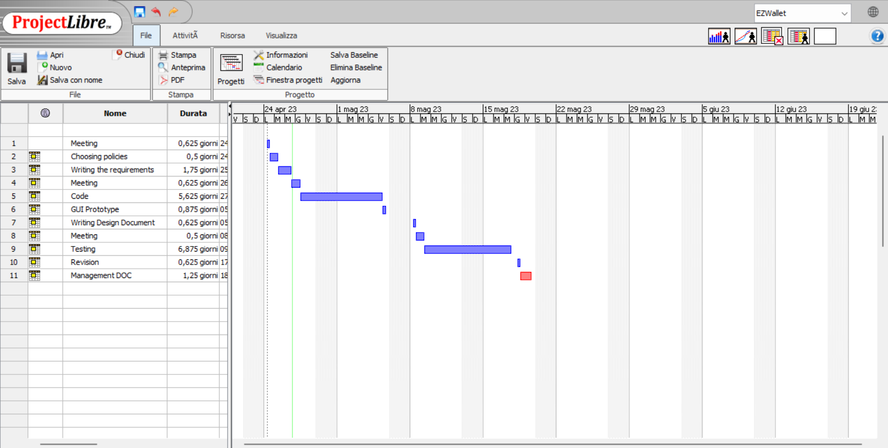

# Project Estimation - CURRENT
Date: 23/04/2023

Version: 1.1

# Estimation approach
Consider the EZWallet  project in CURRENT version (as received by the teachers), assume that you are going to develop the project INDEPENDENT of the deadlines of the course
# Estimate by size
### 
|             | Estimate                        |             
| ----------- | ------------------------------- |  
| NC =  Estimated number of classes to be developed   |       3 classes                      |             
|  A = Estimated average size per class, in LOC       |         315 LOC per classes                   | 
| S = Estimated size of project, in LOC (= NC * A) | 945 LOC|
| E = Estimated effort, in person hours (here use productivity 10 LOC per person hour)  |                                 95 person hours     |   
| C = Estimated cost, in euro (here use 1 person hour cost = 30 euro) | 2850 euro | 
| Estimated calendar time, in calendar weeks (Assume team of 4 people, 8 hours per day, 5 days per week ) |      3 days              |               

# Estimate by product decomposition
### 
|         component name    | Estimated effort (person hours)   |             
| ----------- | ------------------------------- | 
|requirement document    | 18 |
| GUI prototype | 7 |
|design document | 5 |
|code | 45 |
| unit tests | 50 |
| api tests | 5 |
| management documents  | 10 |

# Estimate by activity decomposition
### 
|         Activity name    | Estimated effort (person hours)   |             
| ----------- | ------------------------------- | 
| Meeting | 5 |
| Choosing the policies | 4 |
| Writing the requirements | 14 |
| Meeting | 5 |
| Code | 45 |
| GUI Prototype | 7 |
| Writing Design Document | 5 |
| Meeting | 4 |
| Testing | 55 |
| Revision | 5|
| Management DOC | 10 |

###
Insert here Gantt chart with above activities

# Summary

Report here the results of the three estimation approaches. The  estimates may differ. Discuss here the possible reasons for the difference

|             | Estimated effort                        |   Estimated duration |          
| ----------- | ------------------------------- | ---------------|
| estimate by size | 95 person hours | 3 days
| estimate by product decomposition | 139 person hours | 4 days
| estimate by activity decomposition | 159 person hours | 25 days

The process of  how estimation considers side-activities like meetings could impact on the difference between the third approach with the other two on the estimated duration. Also in estimation by size the hours are splitted between 4 people, while estimation by activity decomposition doesn't consider this suddivision.

