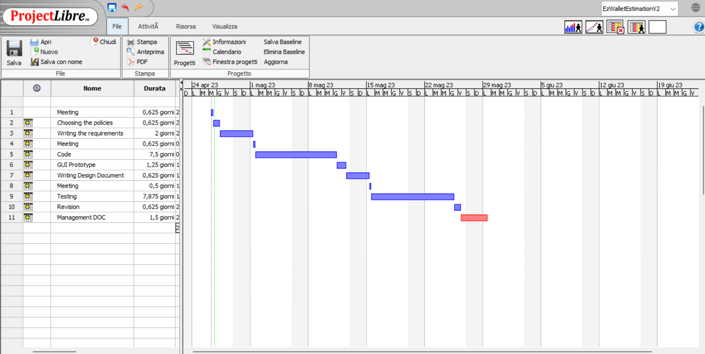

# Project Estimation - FUTURE
Date: 26/04/2023

Version: 1.1

# Estimation approach
Consider the EZWallet  project in FUTURE version (as proposed by the team), assume that you are going to develop the project INDEPENDENT of the deadlines of the course
# Estimate by size
### 
|             | Estimate                        |             
| ----------- | ------------------------------- |  
| NC =  Estimated number of classes to be developed   |  4 classes                  |             
|  A = Estimated average size per class, in LOC       |   450 LOC per classes                     | 
| S = Estimated size of project, in LOC (= NC * A) | 1800 LOC |  
| E = Estimated effort, in person hours (here use productivity 10 LOC per person hour)  |                    180 person hours                   |  
| C = Estimated cost, in euro (here use 1 person hour cost = 30 euro) | 5400 euro | 
| Estimated calendar time, in calendar weeks (Assume team of 4 people, 8 hours per day, 5 days per week ) |       6 days          |               

# Estimate by product decomposition
### 
|         component name    | Estimated effort (person hours)   |             
| ----------- | ------------------------------- | 
|requirement document    | 21 |
| GUI prototype | 10 |
|design document | 5 |
|code | 60 |
| unit tests | 55 |
| api tests | 8 |
| management documents  | 12 |

# Estimate by activity decomposition
### 
|         Activity name    | Estimated effort (person hours)   |             
| ----------- | ------------------------------- | 
| Meeting | 5 |
| Choosing the policies | 5 |
| Writing the requirements | 16 |
| Meeting | 5 |
| Code | 60 |
| GUI Prototype | 10 |
| Writing Design Document | 5 |
| Meeting | 4 |
| Testing | 63 |
| Revision | 5 |
| Management DOC | 12 |
###
Insert here Gantt chart with above activities

# Summary

Report here the results of the three estimation approaches. The  estimates may differ. Discuss here the possible reasons for the difference

|             | Estimated effort                        |   Estimated duration |          
| ----------- | ------------------------------- | ---------------|
| estimate by size | 180 person hours | 6 days |
| estimate by product decomposition | 171 person hours | 5 days |
| estimate by activity decomposition | 190 person hours | 33 days |

