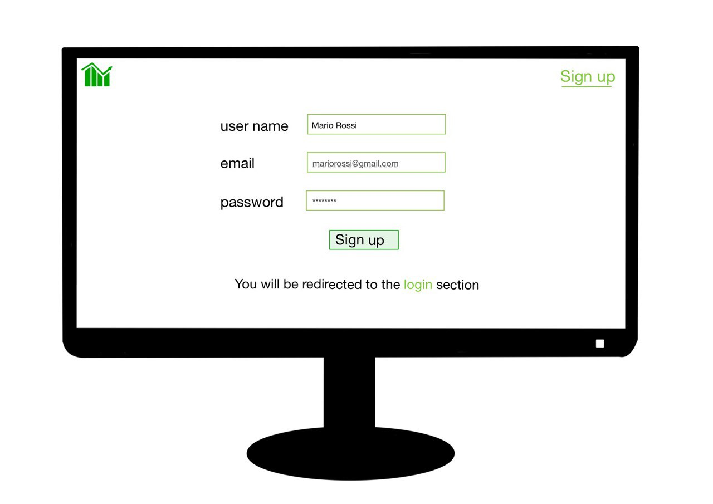

# Graphical User Interface Prototype  - CURRENT

Authors: Nicola Sinisi, Elia Ferraro, Davide Palatroni, Yanlin Xiong

Date: 21/04/2023

Version: v1

This is the first page of our website

Login page

If you are not registered yet you can click on the link under the login form

You cannot register again

You must complete all fields

Valid registration, you are redirected to login form

You insert a wrong email

You insert a wrong password

Your data is right

This is your homepage

This is the form to insert a new transaction

Now you want to create a new category

You made an error and you wanto to delete it

Take a look of transactions

Take a look of categories

Overview

You can do more

View the information of your account

View all users

You cannot login again if you are already logged in

Logout

