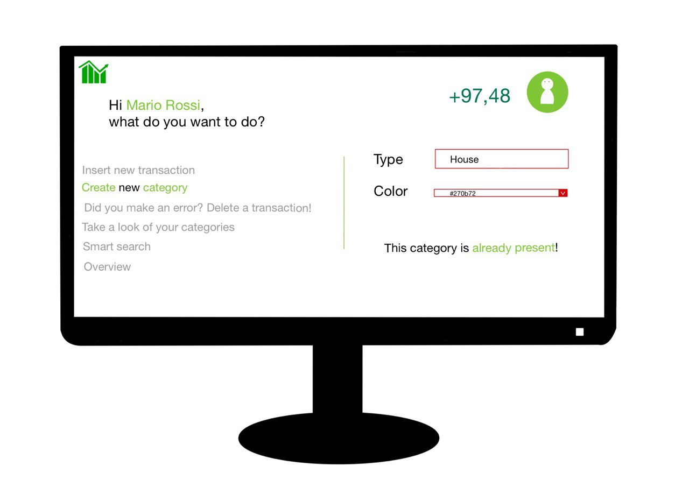

# Graphical User Interface Prototype  - FUTURE

Authors: Nicola Sinisi, Elia Ferraro

Date: 27/04/2023

Version: 1- admin GUI
         2- adding user GUI

<h2>USER GUI</h2>  
This is the first page of our website

The user can see the "help", "product" and "about us" pages

Login page

If you are not registered yet you can click on the link under the login form

You cannot register again

You must complete all fields

Valid registration, you are redirected to payment page 

There's been some problem

Everything went smoothly

You insert a wrong email

You insert a wrong password

Your data is right

If you do not enter any transaction you cannot cancel anything   
(in this case we assume you have already canceled the ezwallet transaction)

Assume that you start using the app right now 
This is your homepage

Insert a new transaction, first you choose the category then you can enter the transaction data

You can create a new category

If you made a mistake you can delete it. You can use the filters to find the wrong transaction faster  
(if you don't enter anything you will see all the transactions)

What happens if no transaction matches the filters you entered
 
Let's assume that the user delete the transaction "Carpet"  
Let's assume that the user received 20€ from his grandmother for the ice cream and add this transaction  
Take a look of all your categories

Do you wanna search and see your transactions? Use our search section  
(remember: if you don't insert any filter you will see all your transactions)

Take a look of your transactions with their respective category

There are other functions

You can see the data related to your account

Do you want an overall view of your financial performance? Our graphics will be useful to you

What happens if no transaction matches the filters you entered

You cannot login if you are already logged in

You have decided to log out, see you

    

<h2>ADMIN GUI</h2> 

This is the first page of our website

Like the user, the admin can see the "help", "product" and "about us" pages

Login page

If you are not registered yet you can click on the link under the login form

You cannot register again

You must complete all fields

Valid registration, you are redirected to check page (can you be an admin?)

The email entered is invalid

The email entered is valid

You insert a wrong email

You insert a wrong password

Your data is right

This is your homepage

You choose to see which are the registered users

You cannot login if you are already logged in

You have decided to log out

