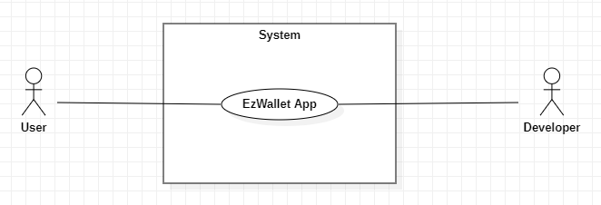
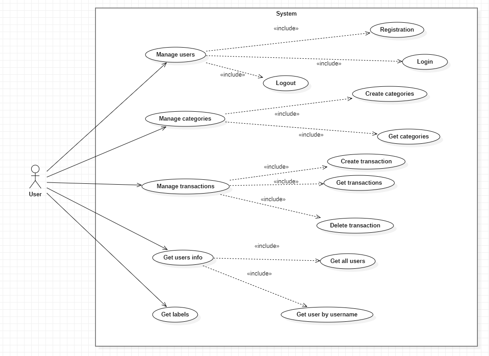
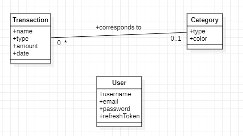
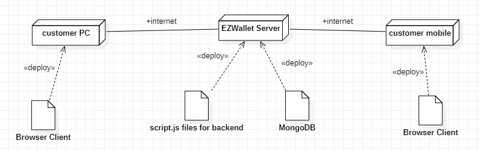

# Requirements Document - current EZWallet

Date: 20/04/2023

Version: V1 - description of EZWallet in CURRENT form (as received by teachers)

 
| Version number | Change |
| ----------------- |:-----------|
|1 | Final version| 

# Contents

- [Informal description](#informal-description)
- [Stakeholders](#stakeholders)
- [Context Diagram and interfaces](#context-diagram-and-interfaces)
	+ [Context Diagram](#context-diagram)
	+ [Interfaces](#interfaces) 
	
- [Stories and personas](#stories-and-personas)
- [Functional and non functional requirements](#functional-and-non-functional-requirements)
	+ [Functional Requirements](#functional-requirements)
	+ [Non functional requirements](#non-functional-requirements)
- [Use case diagram and use cases](#use-case-diagram-and-use-cases)
	+ [Use case diagram](#use-case-diagram)
	+ [Use cases](#use-cases)
    	+ [Relevant scenarios](#relevant-scenarios)
- [Glossary](#glossary)
- [System design](#system-design)
- [Deployment diagram](#deployment-diagram)

# Informal description
EZWallet (read EaSy Wallet) is a software application designed to help individuals and families keep track of their expenses. Users can enter and categorize their expenses, allowing them to quickly see where their money is going. EZWallet is a powerful tool for those looking to take control of their finances and make informed decisions about their spending.

# Stakeholders

| Stakeholder name  | Description | 
| ----------------- |:-----------:|
|   User    |     People who can use the app to enter and categorize their expenses and their revenues, allowing them to quickly see where their money is going        | 
|Developer|Responsible for code maintenance and data management,including database management and data modification|

# Context Diagram and interfaces

## Context Diagram

## Interfaces

| Actor | Logical Interface | Physical Interface  |
| ------------- |:-------------:| -----:|
|   User   | GUI | PC Screen, keyboard and mobile phone |

# Stories and personas

__Persona 1__: individual male.

He focuses more transactions on living expenses (food,clothes,entertainment) and he cares less about other categories of outgoings

__Persona 2__: family with children

They focus on each category of household expenses,including living expenses,education expenses,medical expenses,ecc...

Our app has not been created for people who invest money or have high knowledge about economics because for that kind of people there are other app with more interest on this topic

# Functional and non functional requirements

## Functional Requirements

| ID        | Description  |
| ------------- |:-------------:| 
| FR1    | Manage users|
| FR1.1  | Login |
| FR1.2  | Logout| 
| FR1.3  | Registration|
| FR2  | Manage categories|
| FR2.1  | Create categories|
| FR2.2  | Get categories |
| FR3  | Manage transactions|
| FR3.1  | Create transaction|
| FR3.2  | Get transactions|
| FR3.3  | Delete  transaction|
| FR4  | Get users info|
| FR4.1  | Get all users|
| FR4.2  | Get user by username|
| FR5  | Get transaction information linked to the respective category data(Get labels)|

## Non Functional Requirements

| ID    | Type (efficiency, reliability, ..)| Description  | Refers to |
| ------------- |:-------------:| :-----:| -----:|
|  NFR1     | Efficiency  | Each function’s response time <2000ms |FR1, FR2, FR3, FR4,FR5 |
|  NFR2     |Portability | Can be used with  laptop. Since the website is responsive, it is available also for mobile users |FR1, FR2, FR3, FR4,FR5 |
|  NFR3     |Usability |Take 4-6 minutes to learn how to use it |FR1, FR2, FR3, FR4,FR5 |
| NFR4 | Reliability | Can be available to end user at least for 360 days per year | FR1, FR2, FR3, FR4,FR5| 
| NFR5 |Maintainability|It takes 1-2h/person to fix a bug|FR1, FR2, FR3, FR4,FR5|

# Use case diagram and use cases

## Use case diagram

### Use case 1, REGISTRATION
| Actors Involved        | User |
| ------------- |:-------------:| 
|  Precondition     | User is not registered |
|  Post condition     | User  is registered successfully, account is created |
|  Nominal Scenario     | User needs an account, so he has to insert all required information and if all checks are passed, the account is created |
|  Variants     | / |
|  Exceptions     | User inserts an email which is already associated with another account(email is already registered). Use inputs blank data|

##### Scenario 1.1 - Nominal scenario

| Scenario 1.1 | |
| ------------- |:-------------:| 
|  Precondition     | User is not registered |
|  Post condition     | User is registered successfully, account is created |
| Step#        | Description  |
|  1     | User clicks ‘Login’ button |  
|  2     | User clicks ‘Create’ button |
|  3    | App displays the form to be filled |
|4|User enters username, email and password|
|5|User clicks button to submit|
|6|App checks if there is an account which has the same email|
|7|User is registered successfully|

##### Scenario 1.2 - Blank data

| Scenario 1.2 | |
| ------------- |:-------------:| 
|  Precondition     | User is not registered |
|  Post condition     | Account will not be created |
| Step#        | Description  |
|  1     | User clicks ‘Login’ button |  
|  2     | User clicks ‘Create’ button |
|  3    | App displays the form to be filled |
|4|User enters some data in the form but he leaves a blank field|
|5|User clicks ‘submit’ button|
|6|App checks whether the data is valid|
|7|An error message is displayed in red|

##### Scenario 1.3 - Email is already registerd

| Scenario 1.3 | |
| ------------- |:-------------:| 
|  Precondition     | User has registered |
|  Post condition     | Account will not be created |
| Step# | Description  |
|  	1   | User clicks ‘Login‘ button |  
|  	2   | User clicks ’Create‘ button |
|  	3   | App displays the form to be filled |
|	4	|User enters username, email and password|
|	5	|User clicks ’submit‘ button|
|	6	|App checks if there is an account which has the same email|
|	7	|An error message is displayed in red|

### Use case 2, LOGIN
| Actors Involved        | User |
| ------------- |:-------------:| 
|  Precondition     | User has an account |
|  Post condition     | User logins successfully |
|  Nominal Scenario     | The user enters email and password correctly and the application starts |
|  Variants     | / |
|  Exceptions     | The account（the entered email） does not exist. The password isn’t correct. User is already logged in|

##### Scenario 2.1 - Nominal scenario

| Scenario 2.1 | |
| ------------- |:-------------:| 
|  Precondition     | User has registered |
|  Post condition     | User logins successfully |
| Step# | Description  |
|  	1   | User clicks ’Login‘ button |  
|  	2   | App displays the form to be filled |
|  	3   | User enters email and password |
|	4	|Clicks ’submit‘ button|
|	5	|App checks if user entered correct data|
|	6	|Close login and start application homepage|

##### Scenario 2.2 - Wrong password

| Scenario 2.2 | |
| ------------- |:-------------:| 
|  Precondition     | User has registered |
|  Post condition     | Login unsuccessfully |
| Step# | Description  |
|  	1   | User clicks ’Login‘ button |  
|  	2   | App displays the form to be filled |
|  	3   | User enters email and password |
|	4	|Clicks ’submit‘ button|
|	5	|App checks if user entered correct data|
|	6	|App displays an error message under password field|

##### Scenario 2.3 - The account (entered email) doesn’t exist

| Scenario 2.3 | |
| ------------- |:-------------:| 
|  Precondition     | User is on the login page |
|  Post condition     | User not logged in |
| Step# | Description  |
|  	1   | User clicks ‘Login’ button |  
|  	2   | App displays the form to be filled |
|  	3   | User enters email and password |
|	4	|Clicks ‘submit’ button|
|	5	|App checks if user entered correct data|
|	6	|App displays an error message under email field|

##### Scenario 2.4 - User already logged in

| Scenario 2.4 | |
| ------------- |:-------------:| 
|  Precondition     | User already logged in |
|  Post condition     | Remind user’s status and not login again |
| Step# | Description  |
|  	1   | User opens another window while  using the app |  
|  	2   | Clicks ‘Login’ button |
|  	3   | App displays the form to be filled |
|	4	|User enters his email and password|
|	5	|Clicks ‘submit’ button|
|	6	|App notices that the user has already logged in|
|	7	|App displays a warning message on the bottom of window|

### Use case 3, LOGOUT
| Actors Involved        | User |
| ------------- |:-------------:| 
|  Precondition     | User already logged in |
|  Post condition     | User logouts successfully |
|  Nominal Scenario     | The user clicks on the ‘logout’ button and exits the app |
|  Variants     | / |
|  Exceptions     | / |

##### Scenario 3.1 - Nominal scenario

| Scenario 3.1 | |
| ------------- |:-------------:| 
|  Precondition     | User already logged in |
|  Post condition     | User logouts successfully |
| Step# | Description  |
|  	1   | User clicks on the image on right top of window|  
|  	2   | User clicks on ‘logout’ |
|  	3   | App returns to the login page |

### Use case 4, CREATE CATEGORIES
| Actors Involved        | User |
| ------------- |:-------------:| 
|  Precondition     | User already logged in |
|  Post condition     | Category is created successfully |
|  Nominal Scenario     | The user enters data about the new category he wants and this category is added to the list of categories |
|  Variants     | / |
|  Exceptions     | / |

##### Scenario 4.1 - Nominal scenario

| Scenario 4.1 | |
| ------------- |:-------------:| 
|  Precondition     | User already logged in |
|  Post condition     | Category is created successfully |
| Step# | Description  |
|  	1   | User clicks on the “create new category” button|  
|  	2   | User enters type of category and chooses the color through a color picker. If there is blank data in the ‘type’ field, it will be replaced by “investment”. If there is blank data in the ‘color’ field, a blue color is saved automatically |
|  	3   | User clicks the ‘add’ button |
|	4	|Category is created successfully|

### Use case 5, GET CATEGORIES
| Actors Involved        | User |
| ------------- |:-------------:| 
|  Precondition     | User already logged in |
|  Post condition     | User gets categories’ information |
|  Nominal Scenario     | The user gets all categories’ information |
|  Variants     | / |
|  Exceptions     | No category in the list |

##### Scenario 5.1 - Nominal scenario

| Scenario 5.1 | |
| ------------- |:-------------:| 
|  Precondition     | User already logged in |
|  Post condition     | User gets categories’ information |
| Step# | Description  |
|  	1   | User clicks on the “Take a look of your categories” button|  
|  	2   | App displays all categories’ data |

##### Scenario 5.2 - No category in the list

| Scenario 5.2 | |
| ------------- |:-------------:| 
|  Precondition     | User already logged in and no category is present in the database |
|  Post condition     | No category is displayed |
| Step# | Description  |
|  	1   | User clicks on the “Take a look of your categories” button|  
|  	2   | App don’t shows anything since there are no categories |

### Use case 6, CREATE TRASACTION
| Actors Involved        | User |
| ------------- |:-------------:| 
|  Precondition     | User already logged in |
|  Post condition     | Transaction is created successfully |
|  Nominal Scenario     | User enters data about a transaction and it is added to the transaction list |
|  Variants     | / |
|  Exceptions     | / |

##### Scenario 6.1 - Nominal scenario

| Scenario 6.1 | |
| ------------- |:-------------:| 
|  Precondition     | User already logged in |
|  Post condition     | Transaction is created successfully |
| Step# | Description  |
|  	1   | User clicks on the “Insert new transaction” button|  
|  	2   | User enters data of transactions (name, type and amount). If there is any blank data, it will be replaced by default value (“Anonymous”, “Investment”, 0). The date is automatically set to the date of real time . |
|	3	|User clicks the ‘add’ button|
|	4	|Transaction is created successfully|

### Use case 7, DELETE TRASACTION
| Actors Involved        | User |
| ------------- |:-------------:| 
|  Precondition     | User already logged in |
|  Post condition     | Transaction is deleted successfully |
|  Nominal Scenario     | The app shows all transactions, user chooses the one to be deleted and he clicks on the ‘delete’ symbol |
|  Variants     | / |
|  Exceptions     | No transaction in the list |

##### Scenario 7.1 - Nominal scenario

| Scenario 7.1 | |
| ------------- |:-------------:| 
|  Precondition     | User already logged in |
|  Post condition     | Transaction is deleted successfully |
| Step# | Description  |
|  	1   | User clicks on the “Delete a transaction” button|  
|  	2   | App displays all transactions’ information |
|	3	|User chooses one transaction he wants and clicks the ‘delete’ symbol to delete it|
|	4	|Deleted transaction disappears|

##### Scenario 7.2 - No transaction in the list

| Scenario 7.2 | |
| ------------- |:-------------:| 
|  Precondition     | User already logged in and no transaction is present in the database |
|  Post condition     | No transaction is deleted |
| Step# | Description  |
|  	1   | User clicks on the “Delete a transaction” button|  
|  	2   | App don’t shows anything since there are no transactions |

### Use case 8, GET TRANSACTIONS
| Actors Involved        | User |
| ------------- |:-------------:| 
|  Precondition     | User already logged in |
|  Post condition     | User gets transactions’ information |
|  Nominal Scenario     | The user gets transactions’ information |
|  Variants     | / |
|  Exceptions     | No transaction in the list |

##### Scenario 8.1 - Nominal scenario

| Scenario 8.1 | |
| ------------- |:-------------:| 
|  Precondition     | User already logged in |
|  Post condition     | User gets transactions’  information |
| Step# | Description  |
|  	1   | User clicks on “Take a look of your transactions” button|  
|  	2   | App displays all information about all transactions |

##### Scenario 8.2 - No transaction in the list

| Scenario 8.2 | |
| ------------- |:-------------:| 
|  Precondition     | User already logged in and no transaction is present in the database |
|  Post condition     | No transaction is displayed |
| Step# | Description  |
|  	1   | User clicks on the “Delete a transaction” button|  
|  	2   | App don’t shows anything since there are no transactions |

### Use case 9, GET ALL USERS
| Actors Involved        | User |
| ------------- |:-------------:| 
|  Precondition     | User already logged in |
|  Post condition     | User gets all users’  information |
|  Nominal Scenario     | User can retrieve emails and registration dates for all users |
|  Variants     | / |
|  Exceptions     | / |

##### Scenario 9.1 - Nominal scenario

| Scenario 9.1 | |
| ------------- |:-------------:| 
|  Precondition     | User already logged in |
|  Post condition     | User gets all users’ information |
| Step# | Description  |
|  	1   | User clicks on the image on right top of window|  
|  	2   | User clicks on “view all users” |
|	3	|User gets all users’ information|

### Use case 10, GET USER BY USERNAME
| Actors Involved        | User |
| ------------- |:-------------:| 
|  Precondition     | User already logged in |
|  Post condition     | Gets a specific user’s information |
|  Nominal Scenario     | User gets his own profile information(username, email, registration date, modification date) |
|  Variants     | / |
|  Exceptions     | / |

##### Scenario 10.1 - Nominal scenario

| Scenario 10.1 | |
| ------------- |:-------------:| 
|  Precondition     | User already logged in |
|  Post condition     | Get a user’s own information |
| Step# | Description  |
|  	1   | User clicks on the image on right top of window|  
|  	2   | User clicks on “View info of your account” |
|	3	|Window displays user’s information|

### Use case 11, GET LABELS
| Actors Involved        | User |
| ------------- |:-------------:| 
|  Precondition     | User already logged in |
|  Post condition     | Information about transactions linked to categories obtained |
|  Nominal Scenario     | The user gets labels’ information |
|  Variants     | / |
|  Exceptions     | / |

##### Scenario 11.1 - Nominal scenario

| Scenario 11.1 | |
| ------------- |:-------------:| 
|  Precondition     | User already logged in |
|  Post condition     | Information about transactions linked to categories obtained |
| Step# | Description  |
|  	1   | User clicks on ‘Overview’ button|  
|  	2   | App shows each transaction linked to its correspondent category |

# Glossary

# System Design

# Deployment Diagram 

