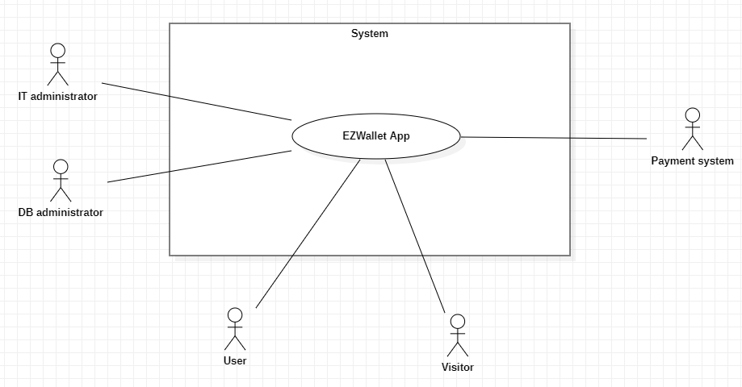
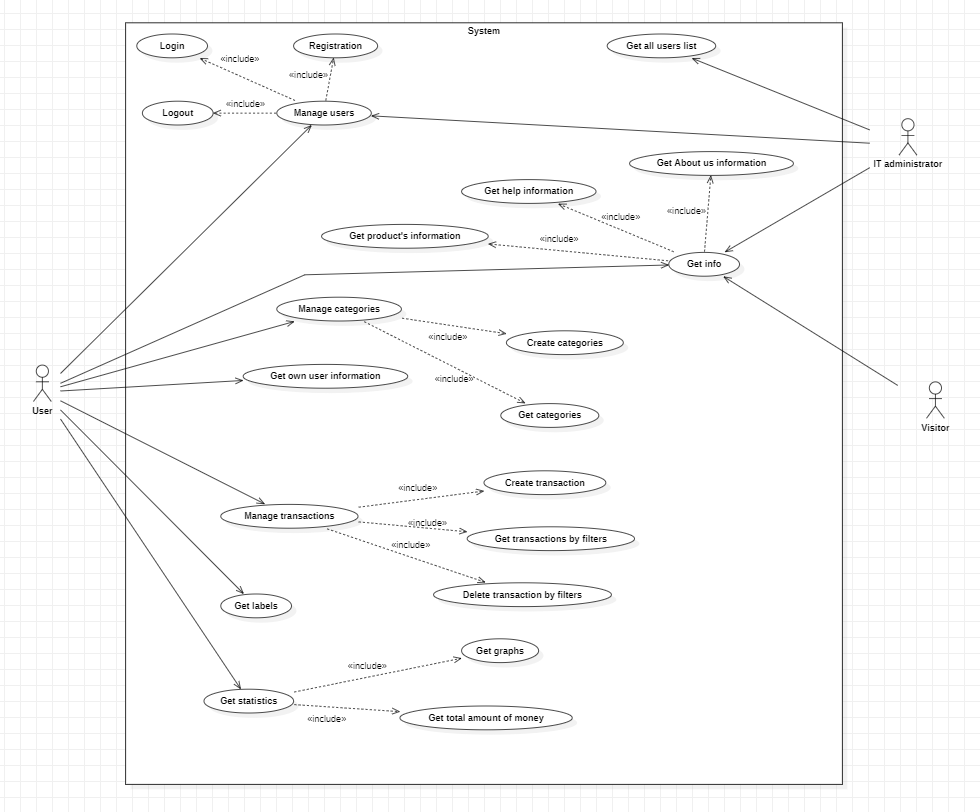
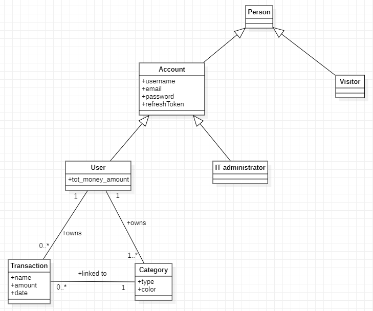
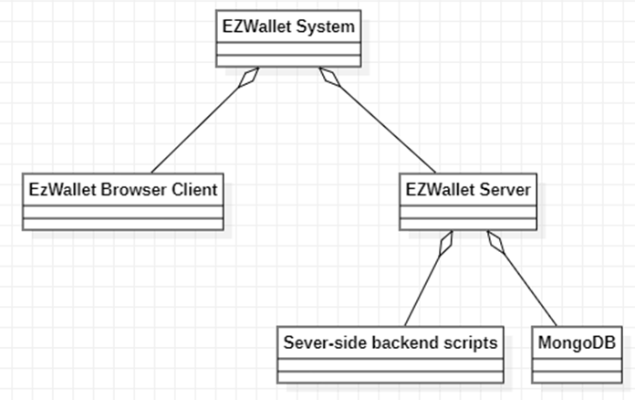
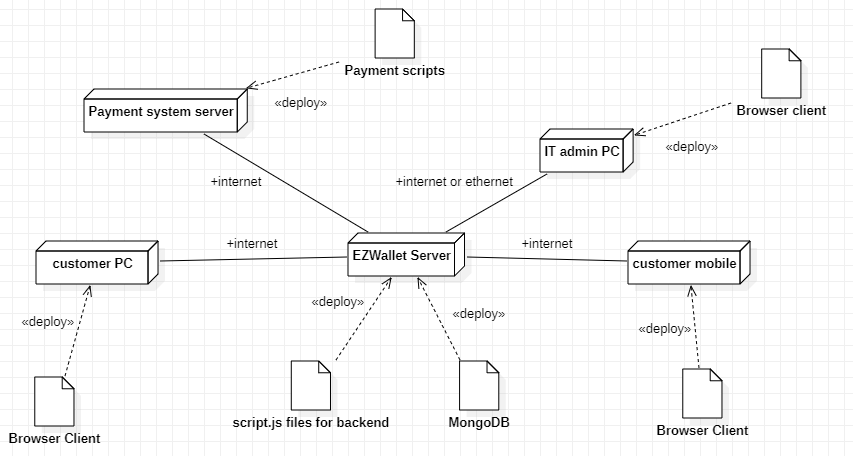

# Requirements Document - future EZWallet

Date: 27/04/2023

Version: V2 - description of EZWallet in FUTURE form (as proposed by the team)

 
| Version number | Change |
| ----------------- |:-----------|
|	2	| Final version | 

# Contents

- [Informal description](#informal-description)
- [Stakeholders](#stakeholders)
- [Context Diagram and interfaces](#context-diagram-and-interfaces)
	+ [Context Diagram](#context-diagram)
	+ [Interfaces](#interfaces) 
	
- [Stories and personas](#stories-and-personas)
- [Functional and non functional requirements](#functional-and-non-functional-requirements)
	+ [Functional Requirements](#functional-requirements)
	+ [Non functional requirements](#non-functional-requirements)
- [Use case diagram and use cases](#use-case-diagram-and-use-cases)
	+ [Use case diagram](#use-case-diagram)
	+ [Use cases](#use-cases)
    	+ [Relevant scenarios](#relevant-scenarios)
- [Glossary](#glossary)
- [System design](#system-design)
- [Deployment diagram](#deployment-diagram)

# Informal description
EZWallet (read EaSy Wallet) is a software application designed to help individuals and families keep track of their money. Users can enter and categorize their expenses, allowing them to quickly see where their money is going. In this new version, each user is independent from the others, since transactions are private and can only be seen by their owner. The app can also show statistics about earnings and outgoings. EZWallet is a powerful tool for those looking to take control of their finances and make informed decisions about their spending.

Our web-app can be used with PC or smartphone and users can register their account after the payment of 2.99€.

# Stakeholders

| Stakeholder name  | Description | 
| ----------------- |:-----------:|
|   User    |     People who can use the app to enter and categorize their expenses and their revenues, allowing them to quickly see where their money is going        |
| Visitor | People who don't register and don't use the app but they only visits the initial page| 
| IT administrator |Responsible for code maintenance such as updating, fixing bugs for the app |
| DB administrator |Responsible for data management,including database management and data modification for the app |
| Payment system | Responsible for managing payment for the app, it accepts multiple payment methods like PayPal, cards, satispay, ... |

# Context Diagram and interfaces

## Context Diagram

## Interfaces

| Actor | Logical Interface | Physical Interface  |
| ------------- |:-------------:| -----:|
|   User   | GUI | PC Screen, keyboard and mobile phone |
|	Visitor	| GUI | PC Screen, keyboard and mobile phone|
|   IT administrator   | GUI | PC Screen, keyboard and mobile phone |
|	DB administrator	|	MongoDB external tools (GUI or command line)	|	PC Screen and keyboard	|
|	Payment system	|	Payment system page	|	API functions calls |

# Stories and personas
__Persona 1__: individual male.

He focuses more transactions on living expenses (food,clothes,entertainment) and he cares less about other categories of outgoings

__Persona 2__: family with children

They focus on each category of household expenses,including living expenses,education expenses,medical expenses,ecc...

__Persona 3__: administrator.

He focuses on data management and modification. He wants to know information about his customers through the users list

__Persona 4__: potential customer.

He is not an user now, but is interested in the app. So he wants to look over the overall product's information and the information of developing team members.

Our app has not been created for people who invest money or have high knowledge about economics because for that kind of people there are other app with more interest on this topic

# Functional and non functional requirements

## Functional Requirements

| ID        | Description  |
| ------------- |:-------------:| 
|  FR1    | Manage users |
|  FR1.1    |  Login |
| FR1.2  | Logout| 
| FR1.3  | Registration|
| FR2  | Manage categories|
| FR2.1 | Create categories|
| FR2.2 | Get categories |
| FR3  | Manage transactions|
| FR3.1  | Create transaction|
| FR3.2  | Get transactions by fiters|
| FR3.3  | Delete  transaction by filters |
| FR4  | Get all users list|
| FR5  | Get own user information|
| FR6  | Get transaction information linked to the respective category data (Get labels)|
| FR7 | Get statistics |
| FR7.1 | Get graphs | 
| FR7.2 | Get total amount of money|
| FR8 | Get info |
| FR8.1  | Get help information|
| FR8.2  | Get product’s information|
| FR8.3  | Get About us information|

## Non Functional Requirements

| ID        | Type (efficiency, reliability, ..)           | Description  | Refers to |
| ------------- |:-------------:| :-----:| -----:|
|  NFR1     | Efficiency  | Each function’s response time <2000ms |FR1, FR2, FR3, FR4, FR5, FR6, FR7, FR8 |
|  NFR2     |Portability | Can be used with  laptop. Since the website is responsive, it is available also for mobile users |FR1, FR2, FR3, FR4, FR5, FR6, FR7, FR8|
|  NFR3     |Usability |Take 5-8 minutes to learn how to use it |FR1, FR2, FR3, FR4, FR5, FR6, FR7, FR8|
| NFR4 | Reliability | Can be available to end user at least for 360 days per year | FR1, FR2, FR3, FR4, FR5, FR6, FR7, FR8| 
|NFR5|Maintainability|It takes 1-2h/person to fix a bug|FR1, FR2, FR3,  FR4, FR5, FR6, FR7, FR8|
| NFR6 | Security | Each user must have his own personal account where personal transactions and categories are stored. Nobody, but him, has access to them | FR1, FR2, FR3, FR4, FR5, FR6, FR7|

# Use case diagram and use cases

## Use case diagram

### Use case 1, REGISTRATION
| Actors Involved        | User or IT Administrator |
| ------------- |:-------------:| 
|  Precondition     | Account is not registered |
|  Post condition     | Account  is registered successfully |
|  Nominal Scenario     | User or Administrator needs an account, so he has to insert all required information and if all checks are passed, the account is created |
|  Variants     | The domain name of registered email can be owned by the EZWallet company |
|  Exceptions     | User or Administrator inserts an email which is already associated with another account(email is already registered). User or Administrator inputs blank data. Payment gone wrong|

##### Scenario 1.1 - Nominal scenario – User

| Scenario 1.1 | |
| ------------- |:-------------:| 
|  Precondition     | User’s account is not registered |
|  Post condition     | User’s account is registered successfully, account created |
| Step#        | Description  |
|  1     | User clicks 'Login' symbol |  
|  2     | User clicks 'Create' button |
|  3    | App displays the form to be filled |
|4|User enters username, email with domain name different from "@ezwallet.com" and password|
|5|User clicks button to sign up|
|6|App checks if there is an account which has the same email|
|7|App jumps to the page of the payment system company|
|8|User enters his payment data requested by the form|
|9|User clicks 'submit' button|
|10|User is redirected to the EZWallet App|
|11|App shows a success message|

##### Scenario 1.2 - Nominal scenario – Administrator

| Scenario 1.2 | |
| ------------- |:-------------:| 
|  Precondition     | Administrator’s account is not registered |
|  Post condition     | Administrator’s account is registered successfully, account created |
| Step#        | Description  |
|  1     | Administrator clicks 'Login' symbol |  
|  2     | Administrator clicks 'Create' button |
|  3    | App displays the form to be filled |
|4|Administrator enters username, email with domain name’@ezwallet.com’ and password|
|5|Administrator clicks button to sign up|
|6|App checks if there is an account which has the same email|
|7|Administrator’s account is registered successfully|

##### Scenario 1.3 - Blank data

| Scenario 1.3 | |
| ------------- |:-------------:| 
|  Precondition     | Account is not registered |
|  Post condition     | Account will not be created |
| Step#        | Description  |
|  1     | User or Administrator clicks 'Login' symbol |  
|  2     | User or Administrator clicks 'Create' button |
|  3    | App displays the form to be filled |
|4|User or Administrator enters some data in the form but he leaves a blank field|
|5|User or Administrator clicks 'Sign up' button|
|6|App checks whether the data is valid|
|7|An error message is displayed in red under the missing field(s)|

##### Scenario 1.4 - Email is already registerd

| Scenario 1.4 | |
| ------------- |:-------------:| 
|  Precondition     | Account has already been registered |
|  Post condition     | Account will not be created |
| Step# | Description  |
|  	1   | User or Administrator clicks 'Login' symbol |  
|  	2   | User or Administrator clicks 'Create' button |
|  	3   | App displays the form to be filled |
|	4	|User or Administrator enters username, email and password|
|	5	|User or Administrator clicks the 'Sign up' button|
|	6	|App checks if there is an account which has the same email|
|	7	|An error message is displayed in red under the email field|

#### Scenario 1.5 - User - Payment gone wrong

| Scenario 1.5 | |
| ------------- |:-------------:| 
|  Precondition     | User’s account is not registered |
|  Post condition     | User’s account is registered unsuccessfully, account will not be created|
| Step#        | Description  |
|  1     | User clicks 'Login' symbol |  
|  2     | User clicks 'Create' button |
|  3    | App displays the form to be filled |
|4|User enters username, email with domain name different from "@ezwallet.com" and password|
|5|User clicks button to sign up|
|6|App checks if there is an account which has the same email|
|7|App jumps to the page of the payment system company|
|8|User enters his payment data requested by the form|
|9|User clicks 'submit' button|
|10|User is redirected to the EZWallet App|
|11|App shows an error message|

### Use case 2, LOGIN
| Actors Involved        | User or IT Administrator |
| ------------- |:-------------:| 
|  Precondition     | User or Administrator has an account |
|  Post condition     | User or Administrator logins successfully |
|  Nominal Scenario     | The user or Administrator enters email and password correctly and the application starts |
|  Variants     | / |
|  Exceptions     | The account（the entered email） does not exist. The password isn’t correct. User or Administrator is already logged in|

##### Scenario 2.1 - Nominal scenario

| Scenario 2.1 | |
| ------------- |:-------------:| 
|  Precondition     | User or Administrator has an account |
|  Post condition     | User or administrator logins successfully |
| Step# | Description  |
|  	1   | User or admin clicks the 'Login' symbol |  
|  	2   | App displays the form to be filled |
|  	3   | User or admin enters email and password |
|	4	|User or admin clicks the 'Login' button|
|	5	|App checks if user or admin entered correct data|
|	6	|App closes login and starts application homepage|

##### Scenario 2.2 - Wrong password
| Scenario 2.2 | |
| ------------- |:-------------:| 
|  Precondition     | User or Administrator has registered |
|  Post condition     | Login unsuccessfully |
| Step# | Description  |
|  	1   | User or Administrator clicks 'Login' symbol |  
|  	2   | App displays the form to be filled |
|  	3   | User or Administrator enters email and password |
|	4	|User or Administrator clicks 'Login' button|
|	5	|App checks if User or Administrator entered correct data|
|	6	|App displays an error message under password field|

##### Scenario 2.3 - The account (entered email) doesn’t exist

| Scenario 2.3 | |
| ------------- |:-------------:| 
|  Precondition     | User or Administrator is on the login page |
|  Post condition     | User or Administrator not logged in |
| Step# | Description  |
|  	1   | User or Administrator clicks 'Login' symbol |  
|  	2   | App displays the form to be filled |
|  	3   | User or Administrator enters email and password |
|	4	|User or Administrator clicks 'Login' button|
|	5	|App checks if User or Administrator entered correct data|
|	6	|App displays an error message under email field|

##### Scenario 2.4 - User or Administrator already logged in

| Scenario 2.4 | |
| ------------- |:-------------:| 
|  Precondition     | User or Administrator already logged in |
|  Post condition     | Remind account’s status and not login again |
| Step# | Description  |
|  	1   | User or Administrator opens another window while  using the app |  
|  	2   | User or Administrator clicks 'Login' symbol |
|  	3   | App displays the form to be filled |
|	4	| User or Administrator enters his email and password|
|	5	| User or Administrator clicks 'Login' button|
|	6	| App notices that the account has already logged in|
|	7	| App displays a warning message on the bottom of window|

### Use case 3, LOGOUT
| Actors Involved        | User or IT Administrator |
| ------------- |:-------------:| 
|  Precondition     | User or Administrator already logged in |
|  Post condition     | User or Administrator logouts successfully |
|  Nominal Scenario     | The user or administrator clicks on the 'logout' button and exits the app |
|  Variants     | / |
|  Exceptions     | / |

##### Scenario 3.1 - Nominal scenario

| Scenario 3.1 |  |
| ------------- |:-------------:| 
|  Precondition     | User or Administrator already logged in |
|  Post condition     | User or Administrator logouts successfully |
| Step# | Description  |
|  	1   | User or Administrator clicks on the image on right top of window|  
|  	2   | User or Administrator clicks on ‘logout’ |
|  	3   | App returns to the firstpage |

### Use case 4, CREATE CATEGORIES
| Actors Involved        | User |
| ------------- |:-------------:| 
|  Precondition     | User already logged in |
|  Post condition     | Category is created successfully |
|  Nominal Scenario     | The user enters data about the new category he wants and this category is added to the personal list of categories |
|  Variants     | / |
|  Exceptions     | User wants to create a category which already exists |

##### Scenario 4.1 - Nominal scenario

| Scenario 4.1 | |
| ------------- |:-------------:| 
|  Precondition     | User already logged in |
|  Post condition     | Personal category is created successfully |
| Step# | Description  |
|  	1   | User clicks on the “create new category” button|
|	2	| App displays the form for category creation|  
|  	3   | User enters type of category and chooses the color through a color picker. If there is blank data in the ‘type’ field, it will be replaced by “investment”. If there is blank data in the ‘color’ field, a blue color is saved automatically |
|  	4   | User clicks the 'add' button |
|	5	| App checks if the category already exists|
|	6	|Personal category is created successfully|

##### Scenario 4.2 - Created category has been existed

| Scenario 4.2 | |
| ------------- |:-------------:| 
|  Precondition     | User already logged in |
|  Post condition     | Personal category is not created again |
| Step# | Description  |
|    1   | User clicks on the “create new category” button|
|  2  | App displays the form for category creation|  
|    3   | User enters type of category and chooses the color through a color picker but these data corresponds to a category which already exists |
|    4   | User clicks the 'add' button |
|	5	| App checks if the category already exists|
|  6  |Personal category is not created  and the app displays a warning message|

### Use case 5, GET CATEGORIES
| Actors Involved        | User |
| ------------- |:-------------:| 
|  Precondition     | User already logged in |
|  Post condition     | User gets categories’ information |
|  Nominal Scenario     | The user gets all personal  categories’ information |
|  Variants     | / |
|  Exceptions     | / |

##### Scenario 5.1 - Nominal scenario

| Scenario 5.1 | |
| ------------- |:-------------:| 
|  Precondition     | User already logged in |
|  Post condition     | User gets personal categories’ information |
| Step# | Description  |
|  	1   | User clicks on the “Take a look of your categories” button|  
|  	2   | App displays all personal categories’ data (type and color attributes) |

### Use case 6, CREATE TRANSACTION
| Actors Involved        | User |
| ------------- |:-------------:| 
|  Precondition     | User already logged in |
|  Post condition     | Transaction is created successfully |
|  Nominal Scenario     | User enters data about a transaction and it is added to the personal transaction list |
|  Variants     |/ |
|  Exceptions     |  No suitable type in drop-down menu |

##### Scenario 6.1 - Nominal scenario

| Scenario 6.1 | |
| ------------- |:-------------:| 
|  Precondition     | User already logged in |
|  Post condition     | Personal transaction is created successfully |
| Step# | Description  |
|  	1   | User clicks on the “Insert new transaction” button|
|	2	| App display a dropdown menu with the list of all available categories (names) with different colors, based on color attributes previously associated to categories and at the bottom of the list, the "add new category" button|  
|	3	| User clicks on an entry to choose a type(category)|
|	4	| App displays the form for the creation of the transaction with the color of the text equals to the color of the category just selected|
|  	5   | User enters data of transactions (name, amount and date). If there is any blank data, it will be replaced by default value (“Anonymous”,  0, real time date). The date is entered through a calendar input | 
|	6	|User clicks the 'add' button|
|	7	|Transaction is created successfully|

##### Scenario 6.2 - No suitable type in drop-down menu  

| Scenario 6.2 | |
| ------------- |:-------------:| 
|  Precondition     | User already logged in |
|  Post condition     | App jumps into "create new category" page|
| Step# | Description  |
|  	1   | User clicks on the “Insert new transaction” button|
|	2	| App display a dropdown menu with only one entry: the "add new category" button| 
|	3	| User clicks on "add new category" button
|	4	| App jumps into "create new category" page|  

### Use case 7, DELETE TRASACTION BY FILTERS
| Actors Involved        | User |
| ------------- |:-------------:| 
|  Precondition     | User already logged in |
|  Post condition     | Transaction deleted successfully |
|  Nominal Scenario     | The app shows all transaction, user chooses the one to be deleted and he clicks on the 'delete' symbol |
|  Variants     | The user can filter transactions |
|  Exceptions     | No transaction in the list. No transaction is founded with filter|

##### Scenario 7.1 - Nominal scenario

| Scenario 7.1 | |
| ------------- |:-------------:| 
|  Precondition     | User already logged in |
|  Post condition     | Transaction is deleted successfully |
| Step# | Description  |
|  	1   | User clicks on the “Delete a transaction” button|  
|  	2   | App displays all transactions’ information and the form for the filtering (name and type) |
|	3	|User chooses one transaction he wants and clicks the 'delete' symbol to delete it|
|	4	|Deleted transaction disappears|

##### Scenario 7.2 - Nominal scenario - Apply filter(type or name)

| Scenario 7.2 | |
| ------------- |:-------------:| 
|  Precondition     | User already logged in |
|  Post condition     | Transaction is deleted successfully |
| Step# | Description  |
|  	1   | User clicks on the “Delete a transaction” button|  
|  	2   | App displays all transactions’ information and the form for the filtering (name and type) |
|	3	|User applies filter(type or name) of transactions|
|	4	| User click the 'search' symbol|
|	5	|App displays filtered transactions’ information|
|	6	|User chooses one transaction he wants and clicks the 'delete' symbol to delete it|
|	7	|Deleted transaction disappears|

##### Scenario 7.3 - No transaction in the list

| Scenario 7.3 | |
| ------------- |:-------------:| 
|  Precondition     | User already logged in and no transaction is present in the database |
|  Post condition     | No transaction is deleted |
| Step# | Description  |
|  	1   | User clicks on the “Delete a transaction” button|  
|  	2   | App don’t shows anything since there are no transactions but a warning message |

##### Scenario 7.4 - No transaction is founded with filter

| Scenario 7.4 | |
| ------------- |:-------------:| 
|  Precondition     | User already logged in|
|  Post condition     | No transaction is deleted |
| Step# | Description  |
|  	1   | User clicks on the “Delete a transaction” button|  
|  	2   | App displays all transactions’ information and the form for the filtering (name and type) |
|	3	| User applies filter(type or name) of transactions|
|	4	| User click the 'search' symbol|
|  	5   | App displays nothing with specific filter but a warning message |

### Use case 8, GET TRANSACTIONS BY FILTERS   
| Actors Involved        | User |
| ------------- |:-------------:| 
|  Precondition     | User already logged in |
|  Post condition     | User gets some or all personal transactions’ information |
|  Nominal Scenario     | The user gets transactions’ information after applying some filters |
|  Variants     | / |
|  Exceptions     | No transaction respects filters | 

##### Scenario 8.1 - Nominal scenario

| Scenario 8.1 | |
| ------------- |:-------------:| 
|  Precondition     | User already logged in |
|  Post condition     | User gets some or all personal transactions’  information |
| Step# | Description  |
|  	1   | User clicks on “Smart search” button|  
|  	2   | App displays the form for filtering transactions |
|	3	| User can choose a date range from a calendar input, or a category name from a dropdown menu or can enter transaction name or amount range. User can also set combinations of filters|
|4|User clicks on the 'Go' button|
|	5	|App displays information about transactions which respects the filters.|

##### Scenario 8.2 - No transaction respects filters

| Scenario 8.2 | |
| ------------- |:-------------:| 
|  Precondition     | User already logged in |
|  Post condition     | Error message displayed |
| Step# | Description  |
|  	1   | User clicks on “Smart search” button|  
|  	2   | App displays the form for filtering transactions |
|	3	| User can choose a date range from a calendar input, or a category name from a dropdown menu or can enter transaction name or amount range. User can also set combinations of filters|
|4|User clicks on the 'Go' button|
|	5	|App displays a message which says that no transaction respects filters|

### Use case 9,  GET ALL USERS LIST
| Actors Involved        | Administrator |
| ------------- |:-------------:| 
|  Precondition     | Administrator already logged in |
|  Post condition     | Administrator gets all users’  information |
|  Nominal Scenario     | Administrator can retrieve emails and registration dates for all users |
|  Variants     | / |
|  Exceptions     | / |

##### Scenario 9.1 - Nominal scenario

| Scenario 9.1 | |
| ------------- |:-------------:| 
|  Precondition     | Administrator already logged in |
|  Post condition     | Administrator gets all users’ information |
| Step# | Description  |
|	1	| Administator can see the total number of registered users in the right top part of the window|
|  	2   | Administrator clicks on the image on right top of window|  
|  	3   | Administrator clicks on "view all users" |
|	4	| Administrator gets all users’ information|

### Use case 10, GET OWN UESR INFORMATION
| Actors Involved        | User |
| ------------- |:-------------:| 
|  Precondition     | User already logged in |
|  Post condition     | User gets his own specific information |
|  Nominal Scenario     | User gets his own profile information(username, email, registration date, modification date) |
|  Variants     | / |
|  Exceptions     | / |

##### Scenario 10.1 - Nominal scenario

| Scenario 10.1 | |
| ------------- |:-------------:| 
|  Precondition     | User already logged in |
|  Post condition     | User gets his own information |
| Step# | Description  |
|  	1   | User clicks on the image on right top of window|  
|  	2   | User clicks on "View info of your account" |
|	3	|Window displays user’s information|

### Use case 11, GET LABELS
| Actors Involved        | User |
| ------------- |:-------------:| 
|  Precondition     | User already logged in |
|  Post condition     | Information about transaction linked to categories obtained |
|  Nominal Scenario     | The user gets labels’ information |
|  Variants     | / |
|  Exceptions     | / |

##### Scenario 11.1 - Nominal scenario

| Scenario 11.1 | |
| ------------- |:-------------:| 
|  Precondition     | User already logged in |
|  Post condition     | Information about transaction linked to categories obtained |
| Step# | Description  |
|  	1   | User clicks on 'Overview' button|  
|  	2   | App shows each transaction linked to its correspondent category |

### Use case 12, GET HELP INFORMATION
| Actors Involved        | User or Administrator or Visitor |
| ------------- |:-------------:| 
|  Precondition     | User or Administrator or Visitor in firstpage |
|  Post condition     | User or Administrator or Visitor gets help information |
|  Nominal Scenario     | User or Administrator or Visitor can get advice about using app and contacting ways|  
|  Variants     | / |
|  Exceptions     | / |

##### Scenario 12.1 - Nominal scenario

| Scenario 12.1 | |
| ------------- |:-------------:| 
|  Precondition     | User or Administrator or Visitor in firstpage |
|  Post condition     | User or Administrator or Visitor gets help information |
| Step# | Description  |
|  	1   | User or Administrator or Visitor clicks on the ‘help’ button on top of window|  
|  	2   | User or Administrator or Visitor gets advice about using app and contacting ways |

### Use case 13, GET ABOUT US INFORMATION
| Actors Involved        | User or Adminisrator or Visitor |
| ------------- |:-------------:| 
|  Precondition     | User or Administrator or Visitor in firstpage |
|  Post condition     | User or Adminisrator or Visitor gets 'about us' information |
|  Nominal Scenario     | User or Administrator or Visitor can get an overview about the company |
|  Variants     | / |
|  Exceptions     | / |

##### Scenario 13.1 - Nominal scenario

| Scenario 13.1 | |
| ------------- |:-------------:| 
|  Precondition     | User or Administrator or Visitor in firstpage |
|  Post condition     | User or Administrator or Visitor gets about us information |
| Step# | Description  |
|  	1   | User or Administrator or Visitor clicks on the ‘about us’ button on top of window|  
|  	2   | User or Administrator or Visitor gets an overview about the company |

### Use case 14, GET PRODUCT'S INFORMATION
| Actors Involved        | User or Administrator or Visitor |
| ------------- |:-------------:| 
|  Precondition     | User or Administrator or Visitor in the firstpage |
|  Post condition     | User or Administrator or Visitor gets product's information |
|  Nominal Scenario     | User or Administrator or Visitor can get an outline for the app |  
|  Variants     | / |
|  Exceptions     | / |

##### Scenario 14.1 - Nominal scenario

| Scenario 14.1 | |
| ------------- |:-------------:| 
|  Precondition     | User or Administrator or Visitor in the firstpage |
|  Post condition     | User or Administrator or Visitor gets product's information |
| Step# | Description  |
|  	1   | User or Administrator or Visitor clicks on the ‘product’ button on top of window|  
|  	2   | User or Administrator or Visitor gets an outline for the app |

### Use case 15, GET TOTAL AMOUNT OF MONEY
| Actors Involved        | User |
| ------------- |:-------------:| 
|  Precondition     | User already logged in |
|  Post condition     | User gets total expenses |
|  Nominal Scenario     | The user gets overall transactions’ expenses |
|  Variants     | / |
|  Exceptions     | / |

##### Scenario 15.1 - Nominal scenario

| Scenario 15.1 | |
| ------------- |:-------------:| 
|  Precondition     | User already logged in |
|  Post condition     | User gets overall expenses’  information |
| Step# | Description  |  
|  	1   | App always displays data and graphics about the total amount of money of the user in the top part of the screen  |

### Use case 16, GET GRAPHS
| Actors Involved        | User |
| ------------- |:-------------:| 
|  Precondition     | User already logged in |
|  Post condition     | User gets some money’ information by filters |
|  Nominal Scenario     | The user obtains three graphs. The first is a pie chart of expenses where slices are divided by categories. The second one is a pie chart of earnings where slices are divided by categories. The third is a line graph representing the trend of total amount of money during a period of time. For the three graphs it is possible to set date ranges to filter transaction which are used to compute graphs. |
|  Variants     | / |
|  Exceptions     | No data is matched |

##### Scenario 16.1 - Nominal scenario

| Scenario 16.1 | |
| ------------- |:-------------:| 
|  Precondition     | User already logged in |
|  Post condition     | User gets expenses’ information he wants |
| Step# | Description  |
|  	1   | User clicks on the profile image in the right top corner|
|   2   | User clicks on the "View statistics" button|
|	3	| App shows a date range filtering form (default values: min(transaction dates) - real time date)
|  	4   | User chooses data for date form|
|   5   | User clicks the 'Go' button|    
|  	6   | App displays the three graphs relative to the date range |

##### Scenario 16.2 - No data is matched

| Scenario 16.2 | |
| ------------- |:-------------:| 
|  Precondition     | User already logged in |
|  Post condition     | User gets warning information |
| Step# | Description  |
|  	1   | User clicks on the profile image in the right top corner|
|   2   | USer clicks on the "View statistics" button|
|	3	| App shows a date range filtering form (default values: min(transaction dates) - today date)
|  	4   | User chooses data for date form|
|   5   |User clicks the 'Go' button|    
|  	6   | No data is matched and app displays warning information |

# Glossary

# System Design

# Deployment Diagram 

