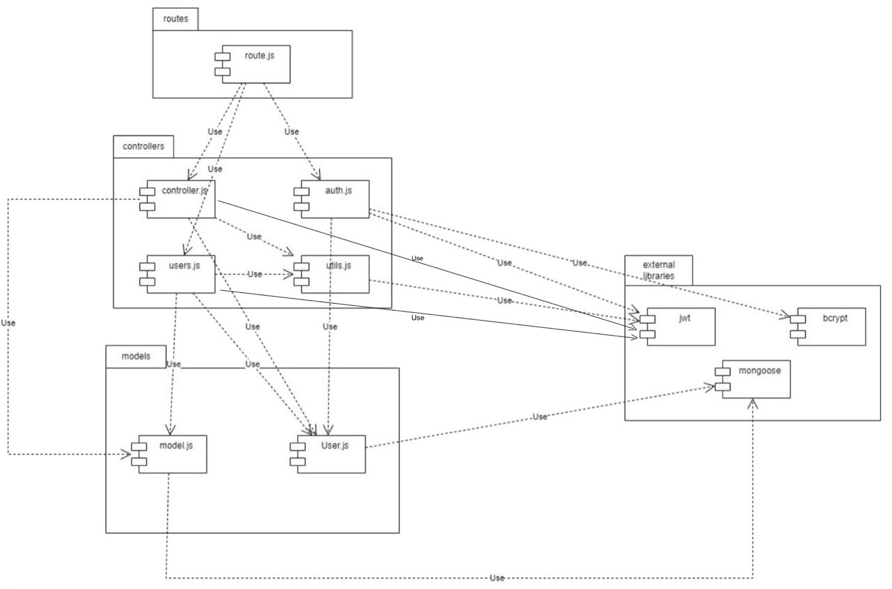
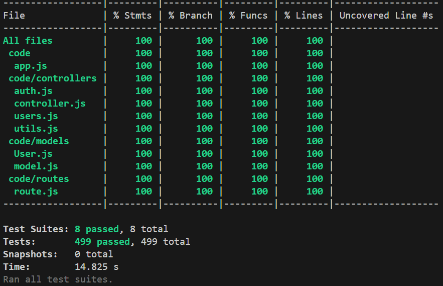

# Test Report

<The goal of this document is to explain how the application was tested, detailing how the test cases were defined and what they cover>

# Contents

- [Dependency graph](#dependency-graph)

- [Integration approach](#integration-approach)

- [Tests](#tests)

- [Coverage](#Coverage)

# Dependency graph 

     <report the here the dependency graph of EzWallet>

# Integration approach

    
    For the implementation of the tests (both unit and integration) we decided to take 'Top down' approach.

    Step 1 : According to the dependency graph and we focused on the controllers part (the only one that also required integration tests)

    Step 2 : We split the whole controllers part into 3 modules: 
    subControllers: include many normal functions,like 'getUser', 'getTransactions', 'create category', ect...
    utils: include functions 'verifyAuth', 'handleAmountFilterParams', 'handleDateFilterParams'.
    auths: include functions 'register', 'login', 'logout', 'registerAdmin'.

    Step 3 : We make the unit test on 'subControllers' module to make sure it can work successfully.

    Step 4 : We make the unit test on 'utils' module to make sure it can work successfully.

    Step 5 : We combine 'utils' and 'subControllers' modules to make the integration test.

    Step 6 : After run integration test on 'utils' and 'subControllers' modules successfully, we make unit test on 'auths' module to make sure it can work successfully.

    Step 7 : We combine all 3 modules ('subControllers' + 'utils'+ 'auths') to make the integration test.

    Step 8 : if the integration test is successful, we finish the integration test.

# Tests

   <in the table below list the test cases defined For each test report the object tested, the test level (API, integration, unit) and the technique used to define the test case  (BB/ eq partitioning, BB/ boundary, WB/ statement coverage, etc)>   <split the table if needed>

| TestID | Test case name | Object(s) tested | Test level | Technique used |
|--|--|--|--|--|
|getUsers_1 |Should return an error if it is not admin authorized |getUsers |unit |WB - statement coverage|
|getUsers_2 |should return empty list if there are no users |getUsers |unit |WB - statement coverage|
|getUsers_3 |should retrieve list of all users |getUsers |unit |WB - statement coverage|
|getUsers_4 |should return 400 if there is an error |getUsers |unit |WB - statement coverage|
|getUsers_5 |Should return an error if it is not admin authorized |getUsers |integration |WB - statement coverage|
|getUsers_6 |should return empty list if there are no users |getUsers |integration |WB - statement coverage|
|getUsers_7 |should retrieve list of all users |getUsers |integration |WB - statement coverage|
|getUser_1 |Should return an error message if the username is not specified |getUser |unit |WB - statement coverage|
|getUser_2 |Should return an error message if the user (regular or admin) is not authorized |getUser |unit |WB - statement coverage|
|getUser_3 |Should return an error message if the regular user is not authorized |getUser |unit |WB - statement coverage|
|getUser_4 |Should return an error message if the username specified (by admin) does not exist |getUser |unit |WB - statement coverage|
|getUser_5 |Should return information of the regular user who called the func |getUser |unit |WB - statement coverage|
|getUser_6 |Should return information of the admin who called the func |getUser |unit |WB - statement coverage|
|getUser_7 |Should return information of the user specified by the admin |getUser |unit |WB - statement coverage|
|getUser_8 |should return 400 if there is an error|getUser |unit |WB - statement coverage|
|getUser_9 |Should return an error message if the username is not specified |getUser |integration |WB - statement coverage|
|getUser_10 |Should return an error message if the user (regular or admin) is not authorized |getUser |integration |WB - statement coverage|
|getUser_11 |Should return an error message if the regular user is not authorized |getUser |integration |WB - statement coverage|
|getUser_12 |Should return an error message if the username specified (by admin) does not exist |getUser |integration |WB - statement coverage|
|getUser_13 |Should return information of the regular user who called the func |getUser |integration |WB - statement coverage|
|getUser_14 |Should return information of the admin who called the func |getUser |integration |WB - statement coverage|
|getUser_15 |Should return information of the user specified by the admin |getUser |integration |WB - statement coverage|
| createTransaction_1 | It should return the correct inserted transaction (called by a regular User) | createTransaction | Unit | BB - eq partitioning |
| createTransaction_2 | It should return a 400 error if the request body does not contain the username (called by a regular User) | createTransaction | Unit | WB - path coverage |
| createTransaction_3 | It should return a 400 error if the request body does not contain the amount (called by a regular User) | createTransaction | Unit | WB - path coverage |
| createTransaction_4 | It should return a 400 error if the request body does not contain the type (called by a regular User) | createTransaction | Unit | WB - path coverage |
| createTransaction_5 | It should return a 400 error if the request body does not contain the username and the amount (called by a regular User) | createTransaction | Unit | WB - path coverage |
| createTransaction_6 | It should return a 400 error if the request body does not contain the username and the type (called by a regular User) | createTransaction | Unit | WB - path coverage |
| createTransaction_7 | It should return a 400 error if the request body does not contain the amount and the type (called by a regular User) | createTransaction | Unit | WB - path coverage |
| createTransaction_8 | It should return a 400 error if the request body does not contain any information (called by a regular User) | createTransaction | Unit | WB - path coverage |
| createTransaction_9 | It should return a 400 error if username in the request body is an empty string (called by a regular User) | createTransaction | Unit | BB - eq partitioning |
| createTransaction_10 | It should return a 400 error if amount in the request body is an empty string (called by a regular User) | createTransaction | Unit | BB - eq partitioning |
| createTransaction_11 | It should return a 400 error if type in the request body is an empty string (called by a regular User) | createTransaction | Unit | BB - eq partitioning |
| createTransaction_12 | It should return a 400 error if username and amount in the request body are an empty string (called by a regular User) | createTransaction | Unit | BB - eq partitioning |
| createTransaction_13 | It should return a 400 error if username and type in the request body are an empty string (called by a regular User) | createTransaction | Unit | BB - eq partitioning |
| createTransaction_14 | It should return a 400 error if amount and type in the request body are an empty string (called by a regular User) | createTransaction | Unit | BB - eq partitioning |
| createTransaction_15 | It should return a 400 error if amount, type and username in the request body are an empty string (called by a regular User) | createTransaction | Unit | BB - eq partitioning |
| createTransaction_16 | It should return a 400 error if the type of category passed in the request body does not represent a category in the database (called by a regular User) | createTransaction | Unit | BB - eq partitioning |
| createTransaction_17 | It should return a 400 error if the username passed in the request body is not equal to the one passed as a route parameter (called by a regular User) | createTransaction | Unit | WB - path coverage |
| createTransaction_18 | It should return a 400 error if the username passed in the request body does not represent a user in the database (called by a regular User) | createTransaction | Unit | WB - path coverage |
| createTransaction_19 | It should return a 400 error if the username passed as a route parameter does not represent a user in the database (called by a regular User) | createTransaction | Unit | WB - path coverage |
| createTransaction_20 | 1 - It should return a 400 error if the amount passed in the request body cannot be parsed as a floating value (negative numbers are accepted) (called by a regular User) | createTransaction | Unit | WB - path coverage |
| createTransaction_21 | 2 - It should return a 400 error if the amount passed in the request body cannot be parsed as a floating value (negative numbers are accepted) (called by a regular User) | createTransaction | Unit | WB - path coverage |
| createTransaction_22 | 3 - It should return a 400 error if the amount passed in the request body cannot be parsed as a floating value (negative numbers are accepted) (called by a regular User) | createTransaction | Unit | WB - path coverage |
| createTransaction_23 | It should return a 401 error if a user is not authorized (called by a regular User) | createTransaction | Unit | WB - path coverage |
| createTransaction_24 | It should return an error if one of the functions line findOne throws an error (called by a regular User) | createTransaction | Unit | WB - path coverage |
| createTransaction_25 | It should return the correct inserted transaction (called by a regular User) | createTransaction | Integration | WB - eq partitioning |
| createTransaction_26 | It should return a 400 error if the request body does not contain the username (called by a regular User) | createTransaction | Integration | WB - path coverage |
| createTransaction_27 | It should return a 400 error if the request body does not contain the amount (called by a regular User) | createTransaction | Integration | WB - path coverage |
| createTransaction_28 | It should return a 400 error if the request body does not contain the type (called by a regular User) | createTransaction | Integration | WB - path coverage |
| createTransaction_29 | It should return a 400 error if the request body does not contain the username and the amount (called by a regular User) | createTransaction | Integration | WB - path coverage |
| createTransaction_30 | It should return a 400 error if the request body does not contain the username and the type (called by a regular User) | createTransaction | Integration | WB - path coverage |
| createTransaction_31 | It should return a 400 error if the request body does not contain the amount and the type (called by a regular User) | createTransaction | Integration | WB - path coverage |
| createTransaction_32 | It should return a 400 error if the request body does not contain any information (called by a regular User) | createTransaction | Integration | WB - path coverage |
| createTransaction_33 | It should return a 400 error if username in the request body is an empty string (called by a regular User) | createTransaction | Integration | BB - eq partitioning |
| createTransaction_34 | It should return a 400 error if amount in the request body is an empty string (called by a regular User) | createTransaction | Integration | BB - eq partitioning |
| createTransaction_35 | It should return a 400 error if type in the request body is an empty string (called by a regular User) | createTransaction | Integration | BB - eq partitioning |
| createTransaction_36 | It should return a 400 error if username and amount in the request body are an empty string (called by a regular User) | createTransaction | Integration | BB - eq partitioning |
| createTransaction_37 | It should return a 400 error if username and type in the request body are an empty string (called by a regular User) | createTransaction | Integration | BB - eq partitioning |
| createTransaction_38 | It should return a 400 error if amount and type in the request body are an empty string (called by a regular User) | createTransaction | Integration | BB - eq partitioning |
| createTransaction_39 | It should return a 400 error if amount, type and username in the request body are an empty string (called by a regular User) | createTransaction | Integration | BB - eq partitioning |
| createTransaction_40 | It should return a 400 error if the type of category passed in the request body does not represent a category in the database (called by a regular User) | createTransaction | Integration | BB - eq partitioning |
| createTransaction_41 | It should return a 400 error if the username passed in the request body is not equal to the one passed as a route parameter (called by a regular User) | createTransaction | Integration | WB - path coverage |
| createTransaction_42 | It should return a 400 error if the username passed in the request body does not represent a user in the database (called by a regular User) | createTransaction | Integration | WB - path coverage |
| createTransaction_43 | It should return a 400 error if the username passed as a route parameter does not represent a user in the database (called by a regular User) | createTransaction | Integration | WB - path coverage |
| createTransaction_44 | 1 - It should return a 400 error if the amount passed in the request body cannot be parsed as a floating value (negative numbers are accepted) (called by a regular User) | createTransaction | Integration | WB - path coverage |
| createTransaction_45 | 2 - It should return a 400 error if the amount passed in the request body cannot be parsed as a floating value (negative numbers are accepted) (called by a regular User) | createTransaction | Integration | WB - path coverage |
| createTransaction_46 | 3 - It should return a 400 error if the amount passed in the request body cannot be parsed as a floating value (negative numbers are accepted) (called by a regular User) | createTransaction | Integration | WB - path coverage |
| createTransaction_47 | It should return a 401 error if a user is not authorized (called by a regular User) | createTransaction | Integration | WB - path coverage |
| getAllTransactions_1 | Should return an error if the admin who calls the function is not authorized (called by an Admin) | getAllTransactions | Unit | WB - path coverage |
| getAllTransactions_2 | Should return all transactions present in the DB (called by an Admin) | getAllTransactions | Unit | BB - eq partitioning |
| getAllTransactions_3 | Should return an error if some function like aggregate throws an error (called by an Admin) | getAllTransactions | Unit | WB - statement coverage |
| getAllTransactions_4| Should return all transactions present in the DB (called by an Admin) | getAllTransactions | Integration | BB - eq partitioning |
| getAllTransactions_5 | Should return an error if the admin who calls the function is not authorized (called by an Admin) | getAllTransactions | Integration | WB - path coverage |
| getTransactionsByUser_1 | Should return an error if handleDateFilterParams and handleAmountFilterParams throw an error | getTransactionsByUser | Unit | WB - statement coverage |
| getTransactionsByUser_2 | Should return an error message if the username specified does not exist | getTransactionsByUser | Unit | WB - path coverage |
| getTransactionsByUser_3 | Should return an array of transaction objects (called by an Admin) | getTransactionsByUser | Unit | BB - eq partitioning |
| getTransactionsByUser_4 | Should return an empty array if no transactions are found (called by an Admin) | getTransactionsByUser | Unit | BB - eq partitioning |
| getTransactionsByUser_5 | Should return an array of transaction objects (called by a Regular user) | getTransactionsByUser | Unit | BB - eq partitioning |
| getTransactionsByUser_6 | Should return an empty array if no transactions are found (called by a Regular User) | getTransactionsByUser | Unit | BB - eq partitioning |
| getTransactionsByUser_7 | Should return an array of transaction objects filtered by date from (called by a Regular user) | getTransactionsByUser | Unit | BB - eq partitioning |
| getTransactionsByUser_8 | Should return an array of transaction objects filtered by date to (called by a Regular user) | getTransactionsByUser | Unit | BB - eq partitioning |
| getTransactionsByUser_9 | Should return an array of transaction objects filtered by date from to (called by a Regular user) | getTransactionsByUser | Unit | BB - eq partitioning |
| getTransactionsByUser_10 | Should return an array of transaction objects filtered by date (called by a Regular user) | getTransactionsByUser | Unit | BB - eq partitioning |
| getTransactionsByUser_11 | Should return an array of transaction objects filtered by amount min (called by a Regular user) | getTransactionsByUser | Unit | BB - eq partitioning |
| getTransactionsByUser_12 | Should return an array of transaction objects filtered by amount max (called by a Regular user) | getTransactionsByUser | Unit | BB - eq partitioning |
| getTransactionsByUser_13 | Should return an array of transaction objects filtered by amount min max (called by a Regular user) | getTransactionsByUser | Unit | BB - eq partitioning |
| getTransactionsByUser_14 | Should return an array of transaction objects filtered by amount min and date (called by a Regular user) | getTransactionsByUser | Unit | BB - eq partitioning |
| getTransactionsByUser_15 | Should return an error if objects filtered by date and from params (called by a Regular user) | getTransactionsByUser | Unit | BB - eq partitioning |
| getTransactionsByUser_16 | Should return an error if objects filtered by date and upTo params (called by a Regular user) | getTransactionsByUser | Unit | BB - eq partitioning |
| getTransactionsByUser_17 | Should return an error if objects filtered by date, from and upTo params (called by a Regular user) | getTransactionsByUser | Unit | BB - eq partitioning |
| getTransactionsByUser_18 | Should return an error if objects filtered by date, where date is not in a correct format (called by a Regular user) | getTransactionsByUser | Unit | WB - path coverage |
| getTransactionsByUser_19 | Should return an error if objects filtered by amount, where amount is not a float number (called by a Regular user) | getTransactionsByUser | Unit | WB - path coverage |
| getTransactionsByUser_20 | Should return an error if the aggregate function throws an error of transaction objects filtered by date (called by a Regular user) | getTransactionsByUser | Unit | WB - path coverage |
| getTransactionsByUser_21 | Should return an error the Regular user is not authorized (called by a Regular user) | getTransactionsByUser | Unit | WB - path coverage |
| getTransactionsByUser_22 | Should return an error the Admin user is not authorized (called by a admin user) | getTransactionsByUser | Unit | WB - path coverage |
| getTransactionsByUser_23 | Should return an error message if the username specified does not exist | getTransactionsByUser | Integration | WB - path coverage |
| getTransactionsByUser_24 | Should return an array of transaction objects (called by an Admin) | getTransactionsByUser | Integration | BB - eq partitioning |
| getTransactionsByUser_25 | Should return an empty array if no transactions are found (called by an Admin) | getTransactionsByUser | Integration | BB - eq partitioning |
| getTransactionsByUser_26 | Should return an array of transaction objects (called by a Regular user) | getTransactionsByUser | Integration | BB - eq partitioning |
| getTransactionsByUser_27 | Should return an empty array if no transactions are found (called by a Regular User) | getTransactionsByUser | Integration | BB - eq partitioning |
| getTransactionsByUser_28 | Should return an array of transaction objects filtered by date from (called by a Regular user) | getTransactionsByUser | Integration | BB - eq partitioning |
| getTransactionsByUser_29 | Should return an array of transaction objects filtered by date to (called by a Regular user) | getTransactionsByUser | Integration | BB - eq partitioning |
| getTransactionsByUser_30 | Should return an array of transaction objects filtered by date from to (called by a Regular user) | getTransactionsByUser | Integration | BB - eq partitioning |
| getTransactionsByUser_31 | Should return an array of transaction objects filtered by date (called by a Regular user) | getTransactionsByUser | Integration | BB - eq partitioning |
| getTransactionsByUser_32 | Should return an array of transaction objects filtered by amount min (called by a Regular user) | getTransactionsByUser | Integration | BB - eq partitioning |
| getTransactionsByUser_33 | Should return an array of transaction objects filtered by amount max (called by a Regular user) | getTransactionsByUser | Integration | BB - eq partitioning |
| getTransactionsByUser_34 | Should return an array of transaction objects filtered by amount min max (called by a Regular user) | getTransactionsByUser | Integration | BB - eq partitioning |
| getTransactionsByUser_35 | Should return an array of transaction objects filtered by amount min and date (called by a Regular user) | getTransactionsByUser | Integration | BB - eq partitioning |
| getTransactionsByUser_36 | Should return an error if objects filtered by date and from params (called by a Regular user) | getTransactionsByUser | Integration | BB - eq partitioning |
| getTransactionsByUser_37 | Should return an error if objects filtered by date and upTo params (called by a Regular user) | getTransactionsByUser | Integration | BB - eq partitioning |
| getTransactionsByUser_38 | Should return an error if objects filtered by date, from and upTo params (called by a Regular user) | getTransactionsByUser | Integration | BB - eq partitioning |
| getTransactionsByUser_39 | Should return an error if objects filtered by date, where date is not in a correct format (called by a Regular user) | getTransactionsByUser | Integration | WB - path coverage |
| getTransactionsByUser_40 | Should return an error if objects filtered by from, where date is not in a correct format (called by a Regular user) | getTransactionsByUser | Integration | WB - path coverage |
| getTransactionsByUser_41 | Should return an error if objects filtered by upTo, where date is not in a correct format (called by a Regular user) | getTransactionsByUser | Integration | WB - path coverage |
| getTransactionsByUser_42 | Should return an error if objects filtered by  min amount, where amount is not a float number (called by a Regular user) | getTransactionsByUser | Integration | WB - path coverage |
| getTransactionsByUser_43 | Should return an error if objects filtered by max amount, where amount is not a float number (called by a Regular user) | getTransactionsByUser | Integration | WB - path coverage |
| getTransactionsByUser_44 | Should return an error the Regular user is not authorized (called by a Regular user) | getTransactionsByUser | Integration | WB - path coverage |
| getTransactionsByUser_45 | Should return an error the Admin user is not authorized (called by a admin user) | getTransactionsByUser | Integration | WB - path coverage |
| getTransactionsByUserByCategory_1 | Should return an error message if the username specified does not exist | getTransactionsByUserByCategory | Unit | WB - path coverage |
| getTransactionsByUserByCategory_2 | Should return an error message if the category specified does not exist | getTransactionsByUserByCategory | Unit | WB - path coverage |
| getTransactionsByUserByCategory_3 | Should return an empty array if no transaction is found with this category and username (called by an Admin) | getTransactionsByUserByCategory | Unit | BB - boudary partitioning |
| getTransactionsByUserByCategory_4 | Should return an empty array if no transaction is found with this category and username (called by a Regular user) | getTransactionsByUserByCategory | Unit | BB - boudary partitioning |
| getTransactionsByUserByCategory_5 | Should return an array of transactions of a specific user with a specific category (called by an Admin) | getTransactionsByUserByCategory | Unit | BB - eq partitioning |
| getTransactionsByUserByCategory_6 | Should return an array of transactions of a specific user with a specific category (called by a Regular User) | getTransactionsByUserByCategory | Unit | BB - eq partitioning |
| getTransactionsByUserByCategory_7 | Should return an error if the user who is calling the function does not correspond to the username param field (called by a Regular User) | getTransactionsByUserByCategory | Unit | WB - path coverage |
| getTransactionsByUserByCategory_8 | Should return an error if the user who calls the function with the admin route is not authenticated as an admin | getTransactionsByUserByCategory | Unit | WB - path coverage |
| getTransactionsByUserByCategory_9 | Should return an error if the aggregate function throws an error | getTransactionsByUserByCategory | Unit | WB - statement coverage |
| getTransactionsByUserByCategory_10 | Should return an array of transactions of a specific user with a specific category (called by an Admin) | getTransactionsByUserByCategory | Integration | BB - eq partitioning |
| getTransactionsByUserByCategory_11 | Should return an array of transactions of a specific user with a specific category (called by a Regular User) | getTransactionsByUserByCategory | Integration | BB - eq partitioning |
| getTransactionsByUserByCategory_12 | Should return an error message if the username specified does not exist (called by an Admin) | getTransactionsByUserByCategory | Integration | WB - path coverage |
| getTransactionsByUserByCategory_13 | Should return an error message if the category specified does not exist (called by an Admin) | getTransactionsByUserByCategory | Integration | WB - path coverage |
| getTransactionsByUserByCategory_14 | Should return an empty array if no transaction is found with this category and username (called by an Admin) | getTransactionsByUserByCategory | Integration | BB - boudary partitioning |
| getTransactionsByUserByCategory_15 | Should return an empty array if no transaction is found with this category and username (called by an Regular User) | getTransactionsByUserByCategory | Integration | BB - boudary partitioning |
| getTransactionsByUserByCategory_16 | Should return an error if the user who is calling the function does not correspond to the username param field (called by a Regular User) | getTransactionsByUserByCategory | Integration | WB - path coverage |
| getTransactionsByUserByCategory_17 | Should return an error if the user who calls the function with the admin route is not authenticated as an admin (called by a fake admin) | getTransactionsByUserByCategory | Integration | WB - path coverage |
| getTransactionsByGroup_1 | It should return an array of transactions linked to the group of the user who calls the function (called by a Regular User) | getTransactionsByGroup | Unit | BB - eq partitioning |
| getTransactionsByGroup_2 | It should return an array of transactions linked to a group specified in params (called by an Admin) | getTransactionsByGroup | Unit | BB - eq partitioning |
| getTransactionsByGroup_3 | It should return an error if the group name specified in the URL does not correspond to any group in the DB (called by an Admin) | getTransactionsByGroup | Unit | WB - path coverage |
| getTransactionsByGroup_4 | It should return an error if the function is called by a regular user who is not in the group (called by a Regular User) | getTransactionsByGroup | Unit | WB - path coverage |
| getTransactionsByGroup_5 | It should return an error if the function is called by an admin who is not authorized (called by an Admin) | getTransactionsByGroup | Unit | WB - path coverage |
| getTransactionsByGroup_6 | It should return an error if aggregate function throws an error (called by an Admin) | getTransactionsByGroup | Unit | WB - statement coverage |
| getTransactionsByGroup_7 | It should return an array of transactions linked to the group of the user who calls the function (called by a Regular User) | getTransactionsByGroup | Integration | BB - eq partitioning |
| getTransactionsByGroup_8 | It should return an array of transactions linked to a group specified in params (called by an Admin) | getTransactionsByGroup | Integration | BB - eq partitioning |
| getTransactionsByGroup_9 | It should return an error if the group name specified in the URL does not correspond to any group in the DB (called by an Admin) | getTransactionsByGroup | Integration | WB - path coverage |
| getTransactionsByGroup_10 | It should return an error if the function is called by a regular user who is not in the group (called by a Regular User) | getTransactionsByGroup | Integration | WB - path coverage |
| getTransactionsByGroup_11 | It should return an error if the function is called by an admin who is not authorized (called by an Admin) | getTransactionsByGroup | Integration | WB - path coverage |
| getTransactionsByGroupByCategory_1 | It should return an array of transactions of a specified category linked to a group specified in params (called by an Admin) | getTransactionsByGroupByCategory | Unit | BB - eq partitioning |
| getTransactionsByGroupByCategory_2 | It should return an array of transactions linked to the group of the user who calls the function (called by a Regular User) | getTransactionsByGroupByCategory | Unit | BB - eq partitioning |
| getTransactionsByGroupByCategory_3 | It should return an error if the group name specified in params does not correspond to any group in the DB (called by an Admin) | getTransactionsByGroupByCategory | Unit | WB - path coverage |
| getTransactionsByGroupByCategory_4 | It should return an error if the category specified in params does not correspond to any category in the DB (called by an Admin) | getTransactionsByGroupByCategory | Unit | WB - path coverage |
| getTransactionsByGroupByCategory_5 | It should return an error if the admin who calls the function is not authorized (called by an Admin) | getTransactionsByGroupByCategory | Unit | WB - path coverage |
| getTransactionsByGroupByCategory_6 | It should return an error if the regular user who calls the functions is not in the group specified in params (called by a Regular User) | getTransactionsByGroupByCategory | Unit | WB - path coverage |
| getTransactionsByGroupByCategory_7 | It should return an error if the aggregate function throws an error (called by an Admin) | getTransactionsByGroupByCategory | Unit | WB - statement coverage |
| getTransactionsByGroupByCategory_8 | It should return an array of transactions of a specified category linked to a group specified in params (called by an Admin) | getTransactionsByGroupByCategory | Integration | BB - eq partitioning |
| getTransactionsByGroupByCategory_9 | It should return an array of transactions linked to the group of the user who calls the function (called by a Regular User) | getTransactionsByGroupByCategory | Integration | BB - eq partitioning |
| getTransactionsByGroupByCategory_10 | It should return an error if the group name specified in params does not correspond to any group in the DB (called by an Admin) | getTransactionsByGroupByCategory | Integration | WB - path coverage |
| getTransactionsByGroupByCategory_11 | It should return an error if the category specified in params does not correspond to any category in the DB (called by an Admin) | getTransactionsByGroupByCategory | Integration | WB - path coverage |
| getTransactionsByGroupByCategory_12 | It should return an error if the admin who calls the function is not authorized (called by an Admin) | getTransactionsByGroupByCategory | Integration | WB - path coverage |
| getTransactionsByGroupByCategory_13 | It should return an error if the regular user who calls the functions is not in the group specified in params (called by a Regular User) | getTransactionsByGroupByCategory | Integration | WB - path coverage |
| deleteTransaction_1 | It should return a correct message | deleteTransaction | Unit | BB - eq partitioning |
| deleteTransaction_2 | It should return a 400 error if the request body does not contain all the necessary attributes | deleteTransaction | Unit | WB - path coverage |
| deleteTransaction_3 | It should return a 400 error if the username passed as a route parameter does not represent a user in the database | deleteTransaction | Unit | WB - path coverage |
| deleteTransaction_4 | It should return a 400 error if the _id in the request body does not represent a transaction in the database | deleteTransaction | Unit | WB - path coverage |
| deleteTransaction_5 | It should return a 401 error if called by an authenticated user who is not the same user as the one in the route | deleteTransaction | Unit | WB - path coverage |
| deleteTransaction_6 | It should return a 400 error if the username specified in the transaction to be deleted and the one derived from the refreshToken are different | deleteTransaction | Unit | WB - path coverage |
| deleteTransaction_7 | It should return a 400 error if a DB function throws an error | deleteTransaction | Unit | WB - statement coverage |
| deleteTransaction_8 | It should return a correct message | deleteTransaction | Integration | BB - eq partitioning |
| deleteTransaction_9 | It should return a 400 error if the request body does not contain all the necessary attributes | deleteTransaction | Integration | WB - path coverage |
| deleteTransaction_10 | It should return a 400 error if the username passed as a route parameter does not represent a user in the database | deleteTransaction | Integration | WB - path coverage |
| deleteTransaction_11 | It should return a 400 error if the _id in the request body does not represent a transaction in the database | deleteTransaction | Integration | WB - path coverage |
| deleteTransaction_12 | It should return a 401 error if called by an authenticated user who is not the same user as the one in the route | deleteTransaction | Integration | WB - path coverage |
| deleteTransaction_13 | It should return a 400 error if the username specified in the transaction to be deleted and the one derived from the refreshToken are different | deleteTransaction | Integration | WB - path coverage |
| handleDateFilterParams_1 | Should give an error because I pass date + another param | handleDateFilterParams |Unit| WB - path coverage |
| handleDateFilterParams_2 | Should throw an error because I pass an invalid format in date | handleDateFilterParams |Unit| WB - path coverage |
| handleDateFilterParams_3 | Should throw an error because I pass an invalid format in from | handleDateFilterParams |Unit| WB - path coverage |
| handleDateFilterParams_4 | Should throw an error because I pass an invalid format in upTo | handleDateFilterParams |Unit| WB - path coverage |
| handleDateFilterParams_5 | Should throw an error because I pass an invalid format in upTo | handleDateFilterParams |Unit| WB - path coverage |
| handleDateFilterParams_6 | Should return an empty query | handleDateFilterParams |Unit| WB - path coverage |
| handleDateFilterParams_7 | Should return a query with $lte and $gte field | handleDateFilterParams |Unit| WB - path coverage | 
| handleDateFilterParams_8 | Should return an object with only $gte field | handleDateFilterParams |Unit| WB - path coverage | 
| handleDateFilterParams_9 | Should return an object with only $lte field | handleDateFilterParams |Unit| WB - path coverage | 
| handleDateFilterParams_10 | Should return an object with $gte and $lte field | handleDateFilterParams |Unit| WB - path coverage |
| handleDateFilterParams_11 | Should give an error because I pass date + another param | handleDateFilterParams | Integration | WB - path coverage |
| handleDateFilterParams_12 | Should throw an error because I pass an invalid format in date | handleDateFilterParams | Integration | WB - path coverage |
| handleDateFilterParams_13 | Should throw an error because I pass an invalid format in from | handleDateFilterParams | Integration | WB - path coverage |
| handleDateFilterParams_14 | Should throw an error because I pass an invalid format in upTo | handleDateFilterParams | Integration | WB - path coverage |
| handleDateFilterParams_15 | Should return an empty query | handleDateFilterParams | Integration | WB - path coverage |
| handleDateFilterParams_16 | Should return a query with $lte and $gte field | handleDateFilterParams | Integration | WB - path coverage |
| handleDateFilterParams_17 | Should return an object with only $gte field | handleDateFilterParams | Integration | WB - path coverage |
| handleDateFilterParams_18 | Should return an object with only $lte field |  handleDateFilterParams |Integration | WB - path coverage |
| handleDateFilterParams_19 | Should return an object with $gte and $lte field | handleDateFilterParams | Integration | WB - path coverage |
| verifyAuth_1 | Should return an error because there are not accessToken and refreshToken | verifyAuth | Unit | WB - path coverage|
| verifyAuth_2 | Should return an error because information in accessToken is missing | verifyAuth | Unit | WB - path coverage|
| verifyAuth_3 | Should return an error because information in refreshToken is missing | verifyAuth | Unit | WB - path coverage|
| verifyAuth_4 | Should return an error because the username in the token and the one passed do not match | verifyAuth | Unit | WB - path coverage|
| verifyAuth_5 | Should return false because the email of the token is not in the group of emails | verifyAuth | Unit | WB - path coverage|
| verifyAuth_6 | Should return an error because the token passed is not admin | verifyAuth | Unit | WB - path coverage|
| verifyAuth_7 | Should return an error because the User passed is not the same of the token | verifyAuth | Unit | WB - path coverage |
| verifyAuth_8 | Should return an error because you have to specify a valid AuthType | verifyAuth | Unit | WB - path coverage |
| verifyAuth_9 | Should return authorized | verifyAuth | Unit | WB - path coverage |
| verifyAuth_10 | Should return an error because both tokens are expired | verifyAuth | Unit | WB - path coverage |
| verifyAuth_11 | Should return authorized and refreshed Token too | verifyAuth | Unit | WB - path coverage |
| verifyAuth_12 | Should return an error because is not admin but the token must be refreshed | verifyAuth | Unit | WB - path coverage |
| verifyAuth_13 | Should return an error because the User passed is not the same of the token but the token must be refreshed | verifyAuth | Unit | WB - path coverage |
| verifyAuth_14 | Should return false because the email of the token is not in the group of emails but the token must be refreshed | verifyAuth | Unit | WB - path coverage |
| verifyAuth_15 | An admin should be verified well and token must be refreshed | verifyAuth | Unit | WB - path coverage |
| verifyAuth_16 | A group should be verified well and token must be refreshed | verifyAuth | Unit | WB - path coverage |
| verifyAuth_17 | A user should be verified well and token must be refreshed | verifyAuth | Unit | WB - path coverage |
| verifyAuth_18 | A User must be verified at first time | verifyAuth | Unit | WB - path coverage |
| verifyAuth_19 | A Group must be verified at first time | verifyAuth | Unit | WB - path coverage |
| verifyAuth_20 | An Admin must be verified at first time | verifyAuth | Unit | WB - path coverage |
| verifyAuth_21 | An error was caused by accessToken and it is not TokenExpiredError | verifyAuth | Unit | WB - path coverage |
| verifyAuth_21 | An error was caused by refreshToken and it is not TokenExpiredError | verifyAuth | Unit | WB - path coverage |
| verifyAuth_21 | Should return an error because the authType is not valid but the token must be refreshed | verifyAuth | Unit | WB - path coverage |
| verifyAuth_22 | Should return an error because there are not accessToken and refreshToken | verifyAuth | Integration | WB - path coverage |
| verifyAuth_23 | Should return an error because information in accessToken is missing | verifyAuth | Integration | WB - path coverage |
| verifyAuth_24 | Should return an error because information in refreshToken is missing | verifyAuth | Integration | WB - path coverage |
| verifyAuth_25 | Should return an error because the username in the token and the one passed do not match | verifyAuth | Integration | WB - path coverage |
| verifyAuth_26 | Should return false because the email of the token is not in the group of emails | verifyAuth | Integration | WB - path coverage |
| verifyAuth_27 | Should return an error because the token passed is not admin |  verifyAuth |Integration | WB - path coverage |
| verifyAuth_28 | Should return an error because the User passed is not the same of the token | verifyAuth | Integration | WB - path coverage |
| verifyAuth_29 | Should return an error because you have to specify a valid AuthType | verifyAuth | Integration | WB - path coverage |
| verifyAuth_30 | Should return an error because both tokens are expired | verifyAuth | Integration | WB - path coverage |
| verifyAuth_31 | Should return authorized but with the token refreshed | verifyAuth | Integration | WB - path coverage |
| verifyAuth_32 | Should return authorized | verifyAuth | Integration | WB - path coverage |
| verifyAuth_33 | Should return an error because is not admin but the token must be refreshed | verifyAuth | Integration | WB - path coverage |
| verifyAuth_34 | Should return an error because the User passed is not the same of the token but the token must be refreshed | verifyAuth | Integration | WB - path coverage |
| verifyAuth_35 | Should return false because the email of the token is not in the group of emails but the token must be refreshed | verifyAuth | Integration | WB - path coverage |
| verifyAuth_36 | An admin should be verified well and token must be refreshed | verifyAuth | Integration | WB - path coverage |
| verifyAuth_37 | A group should be verified well and token must be refreshed | verifyAuth | Integration | WB - path coverage |
| verifyAuth_38 | A user should be verified well and token must be refreshed | verifyAuth | Integration | WB - path coverage |
| verifyAuth_39 | Simple authentication should pass and the token must be refreshed | verifyAuth | Integration | WB - path coverage |
| verifyAuth_40 | A User must be verified at first time | verifyAuth | Integration | WB - path coverage |
| verifyAuth_41 | A Group must be verified at first time | verifyAuth | Integration | WB - path coverage |
| verifyAuth_42 | An Admin must be verified at first time | verifyAuth | Integration | WB - path coverage |
| verifyAuth_43 | Should return an error because the authType is not valid but the token must be refreshed | verifyAuth | Integration | WB - path coverage |
| handleAmountFilterParams_1 | Should throw an error because max is not an integer | handleAmountFilterParams | Unit | WB - path coverage |
| handleAmountFilterParams_2 | Should throw an error because min is not an integer | handleAmountFilterParams | Unit | WB - path coverage |
| handleAmountFilterParams_3 | Should return an empty query | handleAmountFilterParams | Unit | WB - path coverage |
| handleAmountFilterParams_4 | Should return a query with only min | handleAmountFilterParams | Unit | WB - path coverage |
| handleAmountFilterParams_5 | Should return a query with only max | handleAmountFilterParams | Unit | WB - path coverage |
| handleAmountFilterParams_6 | Should return a query with max and min | handleAmountFilterParams | Unit | WB - path coverage |
| handleAmountFilterParams_7 | Should throw an error because max is not an integer | handleAmountFilterParams | Integration | WB - path coverage |
| handleAmountFilterParams_8 | Should throw an error because min is not an integer | handleAmountFilterParams | Integration | WB - path coverage |
| handleAmountFilterParams_8 | Should return an empty query | handleAmountFilterParams | Integration | WB - path coverage |
| handleAmountFilterParams_9 | Should return a query with only min | handleAmountFilterParams | Integration | WB - path coverage |
| handleAmountFilterParams_10 | Should return a query with only max | handleAmountFilterParams | Integration | WB - path coverage |
| handleAmountFilterParams_11 | Should return a query with max and min | handleAmountFilterParams | Integration | WB - path coverage |
| registerAdmin_1 | Should return the successful message with register | registerAdmin | Unit | WB - path coverage |
| registerAdmin_2 | Should return an error if at least one empty string | registerAdmin | Unit | BB - eq partitioning |
| registerAdmin_3 | Should return an error if not contain all the necessary attributes | registerAdmin | Unit | BB - eq partitioning |
| registerAdmin_4 | Should return an error if invalid email format with no "@" symbol | registerAdmin | Unit |BB - eq partitioning |
| registerAdmin_5 | Should return an error if invalid email format with one more "@" symbol | registerAdmin | Unit | BB - eq partitioning |
| registerAdmin_6 | Should return an error if the email exists | registerAdmin | Unit | WB - path coverage |
| registerAdmin_7 | Should return an error if the username exists | registerAdmin | Unit | WB - path coverage |
| registerAdmin_8 | Should return 400 if there is an error| registerAdmin | Unit | WB - statement coverage |
| registerAdmin_9 | Should return the successful message with the change | registerAdmin | Integration | WB - path coverage |
| registerAdmin_10 | Should return an error if at least one empty string | registerAdmin | Integration | BB - eq partitioning |
| registerAdmin_11 | Should return an error if not contain all the necessary attributes | registerAdmin | Integration | BB - eq partitioning |
| registerAdmin_12 | Should return an error if invalid email format with no "@" symbol | registerAdmin | Integration | BB - eq partitioning |
| registerAdmin_13 | Should return an error if invalid email format with one more "@" symbol | registerAdmin | Integration | BB - eq partitioning |
| registerAdmin_14 | Should return an error if the email exists | registerAdmin | Integration | WB - path coverage |
| registerAdmin_15 | Should return an error if the username exists | registerAdmin | Integration | WB - path coverage |
| login_1 | Should return an error if not contain all the necessary attributes | login | Unit | BB - eq partitioning |
| login_2 | Should return an error if at least one empty string | login | Unit | BB - eq partitioning |
| login_3 | Should return an error if invalid email format with no "@" symbol | login | Unit | BB - eq partitioning |
| login_4 | Should return an error if invalid email format with one more "@" symbol | login | Unit | BB - eq partitioning |
| login_5 | Should return an error if the email not exists | login | Unit | WB - path coverage |
| login_6 | Should return an error if the supplied password does not match | login | Unit | WB - path coverage |
| login_7 | Should return successful message | login | Unit | WB - path coverage |
| login_8 | Should return 400 if there is an error| login | Unit | WB - statement coverage |
| login_9 | Should return successful message | login | Integration | WB - path coverage |
| login_10 | Should return an error if not contain all the necessary attributes | login | Integration | BB - eq partitioning |
| login_11 | Should return an error if at least one empty string | login | Integration | BB - eq partitioning |
| login_12 | Should return an error if invalid email format with no "@" symbol | login | Integration | BB - eq partitioning |
| login_13 | Should return an error if invalid email format with one more "@" symbol | login | Integration | BB - eq partitioning |
| login_14 | Should return an error if the email not exists | login | Integration | WB - path coverage |
| login_15 | Should return an error if the supplied password does not match | login | Integration | WB - path coverage |
| logout_1 | Should return an error if it has logged out | logout | Unit | WB - path coverage |
| logout_2 | Should return successful message | logout | Unit | WB - path coverage |
| logout_3 | Should return an error if refresh token does not match | logout | Unit | WB - path coverage |
| logout_4 | Should return 400 if there is an error| logout | Unit | WB - statement coverage |
| logout_5 | Should return successful message | logout | Integration | WB - path coverage |
| logout_6 | Should return an error if it has logged out | logout | Integration | WB - path coverage |
| logout_7 | Should return an error if refresh token does not match | logout | Integration | WB - path coverage |
| deleteTransactions_1 | Should return an error if it is not admin authorized | deleteTransactions | Unit | WB - path coverage |
| deleteTransactions_2 | Should return an error if not contain all the necessary attributes | deleteTransactions | Unit | BB - eq partitioning |
| deleteTransactions_3 | Should return an error if exist empty string | deleteTransactions | Unit | BB - eq partitioning |
| deleteTransactions_4 | Should return an error if Some transactions do not exist | deleteTransactions | Unit | WB - path coverage |
| deleteTransactions_5 | Should return the successful message with the change | deleteTransactions | Unit | WB - path coverage |
| deleteTransactions_6 | Should return 400 if there is an error| deleteTransactions | Unit | WB - statement coverage |
| deleteTransactions_7 | Should return the successful message with the change | deleteTransactions | Integration | WB - path coverage |
| deleteTransactions_8 | Should return an error if not contain all the necessary attributes | deleteTransactions | Integration | BB - eq partitioning |
| deleteTransactions_9 | Should return an error if exist empty string | deleteTransactions | Integration | BB - eq partitioning |
| deleteTransactions_10 | Should return an error if Some transactions do not exist | deleteTransactions | Integration | WB - path coverage |
| deleteTransactions_11 | Should return an error if it is not admin authorized | deleteTransactions | Integration | WB - path coverage |
| removeFromGroup_1 | Should return an error if not contain all the necessary attributes | removeFromGroup | Unit | BB - eq partitioning |
| removeFromGroup_2 | Should return an error if the user is unauthorized | removeFromGroup | Unit | WB - path coverage |
| removeFromGroup_3 | Should return an error if the admin is unauthorized | removeFromGroup | Unit | WB - path coverage |
| removeFromGroup_4 | Should return an error if the user is not an Admin | removeFromGroup | Unit | WB - path coverage |
| removeFromGroup_5 | Should return an error if the user is not in the group | removeFromGroup | Unit | WB - path coverage |
| removeFromGroup_6 | Should return an error if group only exists one member | removeFromGroup | Unit | WB - path coverage |
| removeFromGroup_7 | Should return an error if the group does not exist (Admin route) | removeFromGroup | Unit | WB - path coverage |
| removeFromGroup_8 | Should return an error if there are not members email | removeFromGroup | Unit | BB - eq partitioning |
| removeFromGroup_9 | Should return an error if the request body is empty | removeFromGroup | Unit | BB - eq partitioning |
| removeFromGroup_10 | Should return an error if at least one email has the wrong format | removeFromGroup | Unit | BB - eq partitioning |
| removeFromGroup_11 | Should return an error if al least one email is empty | removeFromGroup | Unit | BB - eq partitioning |
| removeFromGroup_12 | The group is updated. All the users are removed from the group | removeFromGroup | Unit | WB - path coverage |
| removeFromGroup_13 | The group is updated. One user does not exist | removeFromGroup | Unit | WB - path coverage |
| removeFromGroup_14 | The group is updated. One user is in another group | removeFromGroup | Unit | WB - path coverage |
| removeFromGroup_15 | The group is updated. One user does not exist and one is in another group | removeFromGroup | Unit | WB - path coverage |
| removeFromGroup_16 | Should return an error. One user does not exist and one is already in another group : no one can be removed from the group | removeFromGroup | Unit | WB - path coverage |
| removeFromGroup_17 | Should return 400 if there is an error| removeFromGroup | Unit | WB - statement coverage |
| removeFromGroup_18 | Should return an error if it is unauthorized (user) | removeFromGroup | Integration | WB - path coverage |
| removeFromGroup_19 | Should return an error if it is unauthorized (admin) | removeFromGroup | Integration | WB - path coverage |
| removeFromGroup_20 | Should return an error if the memberEmails body is empty| removeFromGroup | Integration | BB - eq partitioning |
| removeFromGroup_21 | Should return an error if the request body is empty | removeFromGroup | Integration | BB - eq partitioning |
| removeFromGroup_22 | Should return an error if the params are empty | removeFromGroup | Integration | BB - eq partitioning |
| removeFromGroup_23 | Should return an error if the user is not an Admin | removeFromGroup | Integration | WB - path coverage |
| removeFromGroup_24 | Should return an error if the group does not exist (Admin route) | removeFromGroup | Integration | WB - path coverage |
| removeFromGroup_25 | Should return an error if the group contains only one member | removeFromGroup | Integration | WB - path coverage |
| removeFromGroup_26 | Should return an error if at least one email has the wrong format | removeFromGroup | Integration | BB - eq partitioning |
| removeFromGroup_27 | Should return an error if at least one email is empty | removeFromGroup | Integration | BB - eq partitioning |
| removeFromGroup_28 | Should return the successful message with all the required users are removed from the group | removeFromGroup | Integration | WB - path coverage |
| removeFromGroup_29 | Should return the successful message with One user does not exist | removeFromGroup | Integration | WB - path coverage |
| removeFromGroup_30 | Should return the successful message with One user in another group | removeFromGroup | Integration | WB - path coverage |
| removeFromGroup_31 | Should return the successful message with One user does not exist and one is in another group | removeFromGroup | Integration | WB - path coverage |
| removeFromGroup_32 | Should return an error. One user does not exist and one is already in another group : no one can be removed from the group | removeFromGroup | Integration | WB - path coverage |
| deleteUser_1 | Should return an error if it is not admin authorizeds | deleteUser | Unit | WB - path coverage |
| deleteUser_2 | Should return an error if not contain all the necessary attributes | deleteUser | Unit | BB - eq partitioning |
| deleteUser_3 | Should return an error if it is an empty string | deleteUser | Unit | BB - eq partitioning |
| deleteUser_4 | Should return an error if invalid email format with no "@" symbol | deleteUser | Unit | BB - eq partitioning |
| deleteUser_5 | Should return an error if invalid email format with one more "@" symbol| deleteUser | Unit | BB - eq partitioning |
| deleteUser_6 | Should return an error if the user does not exist | deleteUser | Unit | WB - path coverage |
| deleteUser_7 | Should return an error if the deleted user is an admin | deleteUser | Unit | WB - path coverage |
| deleteUser_8 | Should return the successful message with the change, user not in a group | deleteUser | Unit | WB - path coverage |
| deleteUser_9 | Should return the successful message with the change, user in a group | deleteUser | Unit | WB - path coverage |
| deleteUser_10 | Should return the successful message with the change, user is the only member in the group | deleteUser | Unit | WB - path coverage |
| deleteUser_11 | Should return 400 if there is an error| deleteUser | Unit | WB - statement coverage |
| deleteUser_12 | Should return the successful message with the change, user not in a group | deleteUser | Integration | WB - path coverage |
| deleteUser_13 | Should return the successful message with the change, user in a group | deleteUser | Integration | WB - path coverage |
| deleteUser_14 | Should return the successful message with the change, user is the only member in the group | deleteUser | Integration | WB - path coverage |
| deleteUser_15 | Should return an error if not contain all the necessary attributes | deleteUser | Integration | BB - eq partitioning |
| deleteUser_16 | Should return an error if it is an empty string | deleteUser | Integration | BB - eq partitioning |
| deleteUser_17 | Should return an error if invalid email format with no "@" symbol | deleteUser | Integration | BB - eq partitioning|
| deleteUser_18 | Should return an error if invalid email format with one more "@" symbol | deleteUser | Integration | BB - eq partitioning |
| deleteUser_19 | Should return an error if the user does not exist | deleteUser | Integration | WB - path coverage |
| deleteUser_20 | Should return an error if the deleted user is an admin | deleteUser | Integration | WB - path coverage |
| deleteUser_21 | Should return an error if it is not admin authorized | deleteUser | Integration | WB - path coverage |
| deleteGroup_1 | Should return an error if it is not admin authorized | deleteGroup | Unit | WB - path coverage |
| deleteGroup_2 | Should return an error if not contain all the necessary attributes | deleteGroup | Unit | BB - eq partitioning |
| deleteGroup_3 | Should return an error if it is an empty string | deleteGroup | Unit | BB - eq partitioning |
| deleteGroup_4 | Should return an error if the group does not exist | deleteGroup | Unit | WB - path coverage |
| deleteGroup_5 | Should return the successful message with the change| deleteGroup | Unit | WB - path coverage |
| deleteGroup_6 | Should return 400 if there is an error| deleteGroup | Unit | WB - statement coverage |
| deleteGroup_7 | Should return the successful message with the change | deleteGroup | Integration | WB - path coverage |
| deleteGroup_8 | Should return an error if the group not exists | deleteGroup | Integration | WB - path coverage |
| deleteGroup_9 | Should return an error if it is an empty string | deleteGroup | Integration | BB - eq partitioning |
| deleteGroup_10 | Should return an error if not contain all the necessary attributes | deleteGroup | Integration | BB - eq partitioning |
| deleteGroup_11 | Should return an error if it is not admin authorized| deleteGroup | Integration | WB - path coverage |
| createCategory_1 | Should return an error because it is not authorized | createCategory | Unit | WB - path coverage |
| createCategory_2 | Should return an error because the category already exists | createCategory | Unit | WB - path coverage |
| createCategory_3 | Should return an error because one element is missing | createCategory | Unit | WB - path coverage |
| createCategory_4 | Should return an error because one element is an empty string | createCategory | Unit | WB - path coverage |
| createCategory_5 | Should return that object that has received | createCategory | Unit | WB - path coverage |
| createCategory_6 | Should retrieve an error in case of error of a DB function | createCategory | Unit | WB - path coverage |
| createCategory_7 | Should give an error because it it not authorized | createCategory | Integration | WB - path coverage |
| createCategory_8 | Should give an error because the category already exists | createCategory | Integration | WB - path coverage |
| createCategory_9 | Should return an error because one element is missing | createCategory | Integration | WB - path coverage |
| createCategory_10 | Should return an error because one element is an empty string | createCategory | Integration | WB - path coverage |
| createCategory_11 | Should return the object with the message | createCategory | Integration | WB - path coverage |
| updateCategory_1 | Should return an error because it is not authorized | updateCategory | Unit | WB - path coverage |
| updateCategory_2 | Should return an error because the category does not exist | updateCategory | Unit | WB - path coverage |
| updateCategory_3 | Should return an error because one element is missing | updateCategory | Unit | WB - path coverage |
| updateCategory_4 | Should return an error because one element is an empty string | updateCategory | Unit | WB - path coverage |
| updateCategory_5 | Should give an error because the category passed as parameter is already present in the database | updateCategory | Unit | WB - path coverage |
| updateCategory_6 | Should return a message of complete and the number of changes | updateCategory | Unit | WB - path coverage |
| updateCategory_7 | Should retrieve an error in case of error of a DB function | updateCategory | Unit | WB - path coverage |
| updateCategory_8 | Should give an error because it is not authorized | updateCategory | Integration | WB - path coverage |
| updateCategory_9 | Should give an error because the category does not exist | updateCategory | Integration | WB - path coverage |
| updateCategory_10 | Should give an error because one parameter is not present | updateCategory | Integration | WB - path coverage |
| updateCategory_11 | Should give an error because one parameter is a empty string | updateCategory | Integration | WB - path coverage |
| updateCategory_12 | Should give an error because the category passed as parameter is already present in the database | updateCategory | Integration | WB - path coverage |
| updateCategory_13 | Should give back the object with the updated changes | updateCategory | Integration | WB - path coverage |
| deleteCategory_1 | Should return an error because it is not authorized | deleteCategory | Unit | WB - path coverage |
| deleteCategory_2 | Should return an error because there is no array in the request | deleteCategory | Unit | WB - path coverage |
| deleteCategory_3 | Should return an error because in the DB there is only one category | deleteCategory | Unit | WB - path coverage |
| deleteCategory_4 | Should return an error because the category does not exist | deleteCategory | Unit | WB - path coverage |
| deleteCategory_5 | Should return an error because one type is an empty string | deleteCategory | Unit | WB - path coverage |
| deleteCategory_6 | Should return the message with the changes | deleteCategory | Unit | WB - path coverage |
| deleteCategory_7 | Should retrieve an error in case of error of a DB function | deleteCategory | Unit | WB - path coverage | 
| deleteCategory_8 | Should return with all changes but there is more categories in the DB | deleteCategory | Unit | WB - path coverage |
| deleteCategory_9 | Should give an error because it is not authorized | deleteCategory | Integration | WB - path coverage |
| deleteCategory_10 | It must return an error because the request does not have an array | deleteCategory | Integration | WB - path coverage |
| deleteCategory_11 | It must return an error because there is only one category in the DB | deleteCategory | Integration | WB - path coverage |
| deleteCategory_12 | It must return an error because one category does not exists | deleteCategory | Integration | WB - path coverage |
| deleteCategory_13 | Should return an error because one category is an empty string | deleteCategory | Integration | WB - path coverage |
| deleteCategory_14 | It must return the message with the changes | deleteCategory | Integration | WB - path coverage |
| deleteCategory_15 | It must return the message with the changes but in DB remain two categories | deleteCategory | Integration | WB - path coverage |
| getCategories_1 | Should return the message with the changes | getCategories | Unit | WB - path coverage |
| getCategories_1 | Should retrieve an error because it is not authorized | getCategories | Unit | WB - path coverage |
| getCategories_2 | Should retrieve an empty array because there are no categories | getCategories | Unit | WB - path coverage |
| getCategories_3 | Should retrieve the list of all categories | getCategories | Unit | WB - path coverage |
| getCategories_4 | Should retrieve an error in case of error of save | getCategories | Unit | WB - path coverage |
| getCategories_5 | Must retrieve an error because it is not authorized | getCategories | Integration | WB - path coverage |
| getCategories_6 | Must retrieve an empty array | getCategories | Integration | WB - path coverage |
| getCategories_7 | Must retrieve the list of all categories | getCategories | Integration | WB - path coverage |
|createGroup_1 |Should return an error if you are not authorized |createGroup |unit |WB - statement coverage|
|createGroup_2 |Should return an error if there are not all the necessary attributes |createGroup |unit |WB - statement coverage|
|createGroup_3 |Should return an error if the group name is an empty string |createGroup |unit |WB - statement coverage|
|createGroup_4 |Should return an error if there is already a group with the specified name |createGroup |unit |WB - statement coverage|
|createGroup_5 |Should return an error if the user is already in a group |createGroup |unit |WB - statement coverage|
|createGroup_6 |Should return an error if one or more emails are wrong |createGroup |unit |WB - statement coverage|
|createGroup_7 |Should return an error if one or more emails are empty string |createGroup |unit |WB - statement coverage|
|createGroup_8 |Should return an error if there are not member emails |createGroup |unit |WB - statement coverage|
|createGroup_9 |A new group is created. All the users are included in the group, who calls the function is not icluded in memerEmails |createGroup |unit |WB - statement coverage|
|createGroup_10 |A new group is created. One user is not found, who calls the function is not icluded in memerEmails |createGroup |unit |WB - statement coverage|
|createGroup_11 |A new group is created. One user is already in a group, who calls the function is not icluded in memerEmails |createGroup |unit |WB - statement coverage|
|createGroup_12 |A new group is created. One user is already in a group, one does not exist, who calls the function is not icluded in memerEmails |createGroup |unit |WB - statement coverage|
|createGroup_13 |Should return an error if no one can be added in the group. One user is already in a group, one user does not exist |createGroup |unit |WB - statement coverage|
|createGroup_14 |should return 400 if there is an error |createGroup |unit |WB - statement coverage|
|createGroup_15 |Should return an error if there is not the name of the group |createGroup |integration |WB - statement coverage|
|createGroup_16 |Should return an error if there are not the member emails |createGroup |integration |WB - statement coverage|
|createGroup_17 |Should return an error if there is already a group with the specified name |createGroup |integration |WB - statement coverage|
|createGroup_18 |Should return an error if the user is already in a group |createGroup |integration |WB - statement coverage|
|createGroup_19 |Should return an error if one or more emails are wrong |createGroup |integration |WB - statement coverage|
|createGroup_20 |Should return an error if one or more emails are empty string |createGroup |integration |WB - statement coverage|
|createGroup_21 |Should return an error if there are not member emails |createGroup |integration |WB - statement coverage|
|createGroup_22 |A new group is created. All the users are included in the group, who calls the function is not icluded in memerEmails |createGroup |integration |WB - statement coverage|
|createGroup_23 |A new group is created. One user is not found |createGroup |integration |WB - statement coverage|
|createGroup_24 |A new group is created. One user is already in a group, who calls the function is not icluded in memerEmails |createGroup |integration |WB - statement coverage|
|createGroup_25 |A new group is created. One user is already in a group, one does not exist, who calls the function is not icluded in memerEmails |createGroup |integration |WB - statement coverage|
|createGroup_26 |Should return an error if no one can be added in the group. One user is already in a group, one user does not exist |createGroup |integration |WB - statement coverage|
|createGroup_27 |Should return an error if you are not authorized |createGroup |integration |WB - statement coverage|
|createGroup_28 |Should return an error if the group name is already an empty string |createGroup |integration |WB - statement coverage|
|getGroups_1 |Should return an error if it is not admin authorized |getGroups |unit |WB - statement coverage|
|getGroups_2 |should return empty list if there are no groups |getGroups |unit |WB - statement coverage|
|getGroups_3 |should retrieve list of all groups |getGroups |unit |WB - statement coverage|
|getGroups_4 |should return 400 if there is an error |getGroups |unit |WB - statement coverage|
|getGroups_5 |Should return an error if it is not admin authorized |getGroups |integration |WB - statement coverage|
|getGroups_6 |Should return an error if the user is not an admin |getGroups |integration |WB - statement coverage|
|getGroups_7 |should return empty list if there are no groups |getGroups |integration |WB - statement coverage|
|getGroups_8 |should retrieve list of all groups |getGroups |integration |WB - statement coverage|
|getGroup_1 |Should return an error message if the group name in not specified |getGroup |unit |WB - statement coverage|
|getGroup_2 |Should return an error message if the user (regular or admin) is not authorized |getGroup |unit |WB - statement coverage|
|getGroup_3 |Should return an error message if the regular user is not authorized |getGroup |unit |WB - statement coverage|
|getGroup_4 |Should return an error message if the group specified (by admin) does not exist |getGroup |unit |WB - statement coverage|
|getGroup_5 |Should return information of the group where regular user (who called the func) is |getGroup |unit |WB - statement coverage|
|getGroup_6 |Should return information of the group where admin (who called the func) is |getGroup |unit |WB - statement coverage|
|getGroup_7 |Should return information of the group specified by the admin |getGroup |unit |WB - statement coverage|
|getGroup_8 |should return 400 if there is an error |getGroup |unit |WB - statement coverage|
|getGroup_9 |Should return an error message if the group name in not specified |getGroup |integration |WB - statement coverage|
|getGroup_10 |Should return an error message if the user (regular or admin) is not authorized |getGroup |integration |WB - statement coverage|
|getGroup_11 |Should return an error message if the regular user is not authorized |getGroup |integration |WB - statement coverage|
|getGroup_12 |Should return an error message if the group specified (by admin) does not exist |getGroup |integration |WB - statement coverage|
|getGroup_13 |Should return information of the group where regular user (who called the func) is |getGroup |integration |WB - statement coverage|
|getGroup_14 |Should return information of the group where admin (who called the func) is |getGroup |integration |WB - statement coverage|
|getGroup_15 |Should return information of the group specified by the admin |getGroup |integration |WB - statement coverage|
|addToGroup_1 |should return an error if it is unauthorized |addToGroup |unit |WB - statement coverage|
|addToGroup_2 |should return an error if the user is unauthorized |addToGroup |unit |WB - statement coverage|
|addToGroup_3 |should return an error if the admin is unauthorized |addToGroup |unit |WB - statement coverage|
|addToGroup_4 |should return an error if the user is not an Admin |addToGroup |unit |WB - statement coverage|
|addToGroup_5 |should return an error if the user is not in the group |addToGroup |unit |WB - statement coverage|
|addToGroup_6 |should return an error if the group does not exist (the user is an Admin) |addToGroup |unit |WB - statement coverage|
|addToGroup_7 |should return an error if there are not members email (the user is an Admin and the group exists) |addToGroup |unit |WB - statement coverage|
|addToGroup_8 |should return an error if the request body is empty (the user is an Admin and the group exists) |addToGroup |unit |WB - statement coverage|
|addToGroup_9 |should return an error if al least one email has the worng format |addToGroup |unit |WB - statement coverage|
|addToGroup_10 |should return an error if al least one email is empty |addToGroup |unit |WB - statement coverage|
|addToGroup_11 |The group is updated. All the users are included in the group |addToGroup |unit |WB - statement coverage|
|addToGroup_12 |The group is updated. One user does not exist |addToGroup |unit |WB - statement coverage|
|addToGroup_13 |The group is updated. One user is already in a group |addToGroup |unit |WB - statement coverage|
|addToGroup_14 |The group is updated. One user does not exist and one is already in a group |addToGroup |unit |WB - statement coverage|
|addToGroup_15 |should return an error. One user does not exist and one is already in a group : no one can be added into the group |addToGroup |unit |WB - statement coverage|
|addToGroup_16 |should return 400 if there is an error |addToGroup |unit |WB - statement coverage|
|addToGroup_17 |should return an error if it is unauthorized (user) |addToGroup |integration |WB - statement coverage|
|addToGroup_18 |should return an error if it is unauthorized (admin) |addToGroup |integration |WB - statement coverage|
|addToGroup_19 |should return an error if the request body is empty |addToGroup |integration |WB - statement coverage|
|addToGroup_20 |should return an error if the request body is empty |addToGroup |integration |WB - statement coverage|
|addToGroup_21 |should return an error if the params are empty |addToGroup |integration |WB - statement coverage|
|addToGroup_22 |should return an error if the user is unauthorized |addToGroup |integration |WB - statement coverage|
|addToGroup_23 |should return an error if the user is not an Admin |addToGroup |integration |WB - statement coverage|
|addToGroup_24 |should return an error if the group does not exist (the user is an Admin) |addToGroup |integration |WB - statement coverage|
|addToGroup_25 |should return an error if al least one email has the worng format |addToGroup |integration |WB - statement coverage|
|addToGroup_26 |should return an error if al least one email is empty |addToGroup |integration |WB - statement coverage|
|addToGroup_27 |The group is updated |addToGroup |integration |WB - statement coverage|
|addToGroup_28 |should return an error because no one can be added into the group |addToGroup |integration |WB - statement coverage|
|register_1 |should return an error if not all fields are entered |register |unit |WB - statement coverage|
|register_2 |should return an error if at least one field is empty |register |unit |WB - statement coverage| 
|register_3 |should return an error if the email has a wrong format |register |unit |WB - statement coverage|
|register_4 |should return an error if the username already exists |register |unit |WB - statement coverage|
|register_5 |should return an error if the email already exists |register |unit |WB - statement coverage|
|register_6 |should create a new user and return 200 |register |unit |WB - statement coverage|
|register_7 |should return 400 if there is an error |register |unit |WB - statement coverage|
|register_8 |should return an error if not all fields are entered |register |integration |WB - statement coverage|    
|register_9 |should return an error if at least one field is empty |register |integration |WB - statement coverage|    
|register_10 |should return an error if the email has a wrong format |register |integration |WB - statement coverage|    
|register_11 |should return an error if the username already exists |register |integration |WB - statement coverage|    
|register_12 |should return an error if the email already exists |register |integration |WB - statement coverage|    
|register_13 |should create a new user and return 200 |register |integration |WB - statement coverage| 

# Coverage

## Coverage of FR

<Report in the following table the coverage of  functional requirements (from official requirements) >

| Functional Requirements covered |   Test(s) | 
| ------------------------------- | ----------- | 
| FR1  Manage users | ------------- |
| FR11  register | register_1 - register_13 |
| FR12 login | login_1 - login_15 |
| FR13 logout | logout_1 - logout_7 |
| FR14  registerAdmin | registerAdmin_1 - registerAdmin_15 |
| FR15  getUsers | getUsers_1 - getUsers_7 |
| FR16  getUser | getUser_1 - getUser_15 |
| FR17  deleteUser | deleteUser_1 - deleteUser_21 |
| FR2  Manage groups | ------------- |
| FR21  createGroup | createGroup_1 - createGroup_28 |
| FR22 getGroups | getGroups_1 - getGroups_8 |
| FR23 getGroup | getGroup_1 - getGroup_15 |
| FR24 addToGroup | addToGroup_1 - addToGroup_28 |
| FR25 removeFromGroup | removeFromGroup_1 - removeFromGroup_32 |
| FR26 deleteGroup | deleteGroup_1-deleteGroup_11 |
| FR3     Manage  transactions| -------------|
| FR31 createTransaction| createTransaction_1 - createTransaction_47 |
| FR32 getAllTransactions | getAllTransactions_1 - getAllTransactions_5 |
| FR33 getTransactionsByUser  | getTransactionsByUser_1 - getTransactionsByUser_39 |
| FR34 getTransactionsByUserByCategory| getTransactionsByUserByCategory_1 - getTransactionsByUserByCategory_17 |
| FR35 getTransactionsByGroup | getTransactionsByGroup_1 - getTransactionsByGroup_11 |
| FR36 getTransactionsByGroupByCategory | getTransactionsByGroupByCategory_1 - getTransactionsByGroupByCategory_13 |
| FR37 deleteTransaction | deleteTransaction_1 - deleteTransaction_13 |
| FR38 deleteTransactions | deleteTransactions_1 - deleteTransactions_11 |
| FR4                 Manage categories | -------------|
| FR41 createCategory | createCategory_1 - createCategory_11|
| FR42 updateCategory | updateCategory_1 - updateCategory_13|
| FR43 deleteCategory | deleteCategory_1 - deleteCategory_15|
| FR44 getCategories |  getCategories_1 - getCategories_7 |

## Coverage white box

Report here the screenshot of coverage values obtained with jest-- coverage 

